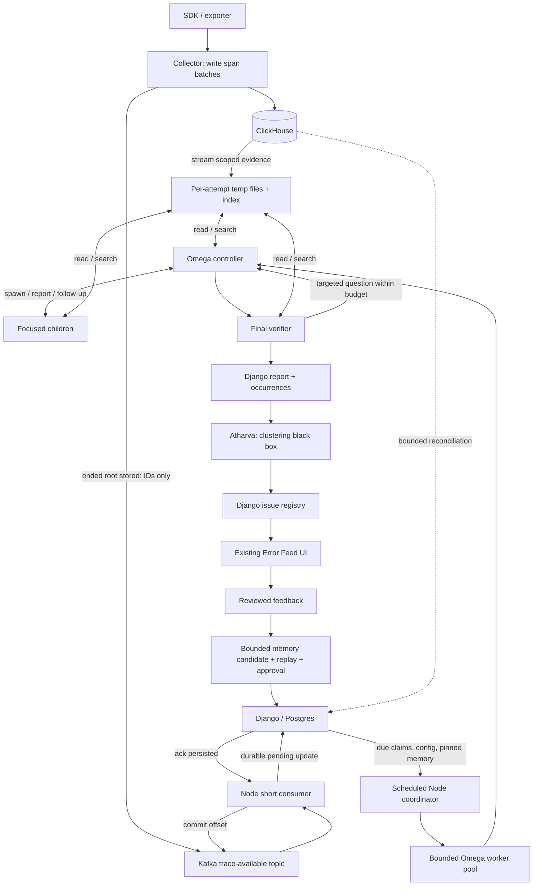

# Error Feed v2 — Kafka, Node and Omega data-flow plan

Status: proposed architecture for review, 11 September 2026. Documentation only; this change does not implement or benchmark the flow. Supersedes the earlier Temporal-centered plan; the previous local files were backed up outside this branch.

## Read this first

Kafka announces that an ended root span has been stored. A Node consumer records pending trace IDs, then acknowledges Kafka. A scheduled Node loop claims due work after a short delay and runs bounded Omega investigations. Trusted Node readers stream complete available evidence from ClickHouse into temporary files. Django publishes reports and passes validated occurrences to Atharva's clustering black box.

A root ending means the agent ended that root operation. It does not prove all exported child spans have arrived. The example uses a fixed 60-second delay, consistent with the existing sweep grace period, not a completion guarantee or a per-span quiet timer. The earlier shorthand “async/await jobs” describes execution; durable pending records and claims provide restart recovery.

All JSON below is synthetic illustrative data. IDs such as `project_7`, digests, token counts, limits and timestamps are readable placeholders, not production identifiers, measured results or finalized serializers. Operations are logical proposed service contracts, not existing HTTP endpoints. Actual OTLP and ClickHouse wire shapes remain behind adapters. Authentication/tenant scope must come from trusted identity and be checked against every request.

The example agent is asked to refund USD 100 for order O-42. Its tool receipt records USD 10, while its final message claims USD 100. Follow the same trace_17, attempt_1, finding_1 and occ_17_1 through every boundary.

## Decisions in this revision

- Reuse the Kafka broker; add a dedicated trace-available topic/message. Existing property-catalog messages aggregate attributes and omit trace IDs.
- Node runs the Kafka consumer, scheduled coordinator and bounded async investigation pool. These can share one deployable service with separate concurrency limits.
- No new Temporal workflow is required by this proposal. Existing Temporal elsewhere in Future AGI remains outside this change.
- Django/Postgres owns job claims, configuration, official results, registry state, feedback and versioned memory.
- ClickHouse owns canonical spans. Temp files hold a disposable frozen copy of evidence available to one attempt. LLM context contains selected reads, not every file.
- Claim/due operations are durable; do not hold a Kafka partition while an LLM runs or allocate a timer/promise for every waiting trace.
- This walkthrough uses all eligible traces. Sampling/representative selection is configurable future admission behavior that needs explicit product approval and coverage metrics; it is not silently enabled here.
- Whole-investigation automatic retries are off by default. Bounded provider-call retries, durable publication retries and later scheduled revisits are separate decisions.
- Clustering is Atharva's black box. Its proposed occurrence-in/assignment-out interface below requires agreement; no grouping implementation is prescribed.
- Memory and feedback stay in scope. Consolidation, evaluation, reviewed promotion and rollback are separate scheduled jobs and proposed work, not claims of existing implementation.
- Keep Omega private: a private package inside a private Node image. Exact package/base-image layering can be chosen for release convenience. No Omega source is copied into Django.

## Whole architecture



## Where data lives

| Store/component      | Data                                                                                | Lifetime / owner                                                |
| -------------------- | ----------------------------------------------------------------------------------- | --------------------------------------------------------------- |
| ClickHouse           | Canonical spans including inputs, outputs and heavy fields                          | Existing retention; canonical reader semantics                  |
| Kafka                | Small root-written notifications, partition offsets                                 | Configured broker retention; independent Error Feed topic/group |
| Django/Postgres      | Pending work, claims, reports, evidence excerpts, grouping status, feedback, memory | Durable product/control state; batched updates                  |
| Node process         | Bounded current jobs, small manifests, tool pages                                   | Per-process limits; restart does not define completion          |
| Temporary disk       | Fetched trace JSONL, paged span index, optional tool receipts                       | Per attempt; cleanup and quotas required                        |
| Model context        | Original task, bounded pinned memory, selected evidence/tool output                 | Per call/session; every read consumes context                   |
| Clustering black box | Occurrence batches and scoped registry candidates                                   | Atharva-owned implementation; persistence via agreed boundary   |

Object storage is not required for trace transport in this proposal. Durable immutable evidence artifacts can be added when exact input replay is required. Accepted reports must include retained citation excerpts so deleting scratch does not break evidence links.

## Identities and delivery rules

| Identity                    | Meaning                                                                                |
| --------------------------- | -------------------------------------------------------------------------------------- |
| event_id                    | One emission; stable across retries, new for a later emission                          |
| topic/partition/offset      | Transport delivery identity; offset commit follows durable handoff                     |
| job_id + generation         | Logical pending work; newer work is not erased by an older completion                  |
| attempt_id + lease_token    | One execution and its current claim owner                                              |
| evidence_digest             | Actual fetched evidence bytes/canonical records; not a guarantee of historic CH replay |
| memory snapshot/digest      | Fixed context for this attempt                                                         |
| report_id / finding_id      | Stored run and individual supported claim                                              |
| occurrence_id               | A finding occurrence passed to clustering                                              |
| issue_id / registry_version | Grouped product issue and assignment concurrency control                               |

Django validates the claim and accepted result digest before updating the active projection. A duplicate identical publication returns its original receipt; an incompatible payload for the same accepted attempt is rejected. A new notification arriving during a run remains pending through its own generation. Pending work and inbox dedup records need retention/compaction policies sized to the Kafka replay horizon; do not assume free unlimited PG storage.

## Complete walkthrough: every boundary

Each numbered step specifies input, output, persistence and failure behavior. Request/response means a logical exchange: some are Kafka deliveries, streams, filesystem operations or model tool calls rather than HTTP.

## 01. Receive spans

**Boundary:** SDK / exporter → collector

Illustrative decoded span batch. Existing OTLP wire encoding and authentication remain in the ingestion adapter. The collector derives tenant scope from authentication.

Input / request:

```json
{
  "organization_id": "org_1",
  "workspace_id": "ws_1",
  "project_id": "project_7",
  "trace_id": "trace_17",
  "spans": [
    {
      "span_id": "span_root",
      "parent_span_id": null,
      "input": {
        "request": "Refund exactly USD 100 for order O-42."
      },
      "output": {
        "message": "Refunded USD 100."
      },
      "end_time": "2026-09-11T10:00:00Z"
    },
    {
      "span_id": "span_refund",
      "parent_span_id": "span_root",
      "input": {
        "tool": "refund",
        "order_id": "O-42",
        "amount": 10,
        "currency": "USD"
      },
      "output": {
        "refund_id": "R-9",
        "status": "posted",
        "amount": 10,
        "currency": "USD"
      },
      "end_time": "2026-09-11T09:59:59Z"
    }
  ]
}
```

Output / response:

```json
{
  "http_status": 200,
  "meaning": "accepted by collector; not a whole-trace completion receipt"
}
```

**Stored / next:** Collector buffers span rows; batches may mix traces and arrive out of order.

**Failure / alternate path:** Rejected auth/invalid scope fails ingestion. HTTP acceptance alone must not trigger a stored-trace notification.

## 02. Store the batch

**Boundary:** Collector → ClickHouse

Flush by batch size or timer; publish only after the storage boundary is satisfied.

Input / request:

```json
{
  "operation": "insert_spans",
  "organization_id": "org_1",
  "workspace_id": "ws_1",
  "project_id": "project_7",
  "trace_id": "trace_17",
  "span_ids": ["span_root", "span_refund"],
  "write_mode": "synchronous"
}
```

Output / response:

```json
{
  "http_status": 200,
  "stored_batch": "batch_801",
  "root_spans_in_batch": ["span_root"]
}
```

**Stored / next:** Canonical spans stay in ClickHouse. This receipt covers this batch only.

**Failure / alternate path:** Failed inserts do not emit a stored-root event. Current optional async_insert with wait_for_async_insert=0 needs a visibility-aware change or disabling for this path.

## 03. Announce a stored root

**Boundary:** Collector → Kafka

Proposed dedicated topic on the existing broker. This first design emits after ended root spans are stored; no per-span quiet timer is required. Split batches by count and encoded bytes.

Input / request:

```json
{
  "topic": "error-feed.trace-available.v1",
  "key": "org_1/ws_1/project_7",
  "value": {
    "version": 1,
    "event_id": "event_901",
    "organization_id": "org_1",
    "workspace_id": "ws_1",
    "project_id": "project_7",
    "event_kind": "root_span_written",
    "traces": [
      {
        "trace_id": "trace_17",
        "root_span_id": "span_root",
        "root_end_time": "2026-09-11T10:00:00Z"
      }
    ],
    "emitted_at": "2026-09-11T10:00:02Z"
  }
}
```

Output / response:

```json
{
  "topic": "error-feed.trace-available.v1",
  "partition": 3,
  "offset": 108,
  "broker_acknowledged": true
}
```

**Stored / next:** The event carries IDs, never full trace bodies. event_id remains stable across retries of this emission; later emissions get new IDs.

**Failure / alternate path:** Bound the producer queue/deadline. A CH write followed by publication failure leaves a notification gap recovered by step 27. Existing property-catalog messages are not this schema.

## 04. Persist incoming work

**Boundary:** Node Kafka consumer → Django control operation → Postgres

Consume short batches. In one DB transaction, deduplicate transport deliveries and record pending work. This logical operation is proposed; it is not an existing HTTP route.

Input / request:

```json
{
  "operation": "record_trace_notifications",
  "deliveries": [
    {
      "topic": "error-feed.trace-available.v1",
      "partition": 3,
      "offset": 108,
      "value": {
        "version": 1,
        "event_id": "event_901",
        "organization_id": "org_1",
        "workspace_id": "ws_1",
        "project_id": "project_7",
        "event_kind": "root_span_written",
        "traces": [
          {
            "trace_id": "trace_17",
            "root_span_id": "span_root",
            "root_end_time": "2026-09-11T10:00:00Z"
          }
        ],
        "emitted_at": "2026-09-11T10:00:02Z"
      }
    }
  ]
}
```

Output / response:

```json
{
  "accepted_events": 1,
  "duplicate_events": 0,
  "pending": [
    {
      "organization_id": "org_1",
      "workspace_id": "ws_1",
      "project_id": "project_7",
      "trace_id": "trace_17",
      "job_id": "job_17",
      "generation": 1,
      "state": "waiting",
      "not_before": "2026-09-11T10:01:02Z"
    }
  ]
}
```

**Stored / next:** Durable pending IDs and due times survive Node restart. DB receipt time anchors the example 60-second delay. Pending IDs are retained while needed, not an everlasting row per incoming span.

**Failure / alternate path:** If DB persistence fails, leave offset uncommitted. At sustained scale, batch/coalesce writes and measure pending-state storage; bounded overflow must mark the project for reconciliation.

## 05. Acknowledge delivery

**Boundary:** Node consumer → Kafka

Commit only the contiguous offsets whose pending work has been durably recorded. The committed offset is the next record to read.

Input / request:

```json
{
  "operation": "commit_offsets",
  "consumer_group": "error-feed-discovery-v1",
  "offsets": [
    {
      "topic": "error-feed.trace-available.v1",
      "partition": 3,
      "next_offset": 109
    }
  ]
}
```

Output / response:

```json
{
  "committed": true
}
```

**Stored / next:** The broker no longer needs to redeliver this record. Omega has not started yet.

**Failure / alternate path:** Crash between step 04 and 05 causes harmless replay through the durable inbox. Never commit past a failed earlier record in the partition.

## 06. Wait and select due work

**Boundary:** Scheduled Node coordinator → Django control operation

A short periodic tick claims eligible work. not_before replaces an in-memory sleep per trace. Apply project enablement, fair quotas and the explicit admission policy.

Input / request:

```json
{
  "operation": "claim_due_investigations",
  "worker_id": "node_2",
  "engine_version": "ef-v2-doc-example",
  "now": "2026-09-11T10:01:03Z",
  "limit": 5
}
```

Output / response:

```json
{
  "claims": [
    {
      "organization_id": "org_1",
      "workspace_id": "ws_1",
      "project_id": "project_7",
      "job_id": "job_17",
      "trace_id": "trace_17",
      "generation": 1,
      "attempt_id": "attempt_1",
      "lease_token": "lease_17_v1",
      "lease_expires_at": "2026-09-11T10:03:03Z",
      "selection": {
        "policy": "all_eligible",
        "reason": "root_available"
      }
    }
  ],
  "deferred": []
}
```

**Stored / next:** A unique active claim prevents concurrent duplicate work. All eligible traces are selected in this walkthrough. Sampling/representative selection is a separately configured policy, not silently added here.

**Failure / alternate path:** No due work returns claims:[]. Capacity exhaustion defers visibly. Claims must filter engine compatibility and reserve shared org/project/provider capacity atomically.

## 07. Pin context and limits

**Boundary:** Node worker → Django context operation

Fetch a bounded immutable memory snapshot, config and allowed verification capabilities for this claimed attempt.

Input / request:

```json
{
  "operation": "get_investigation_context",
  "organization_id": "org_1",
  "workspace_id": "ws_1",
  "project_id": "project_7",
  "job_id": "job_17",
  "attempt_id": "attempt_1",
  "lease_token": "lease_17_v1"
}
```

Output / response:

```json
{
  "engine_version": "ef-v2-doc-example",
  "contract_version": "investigation-proposed/v1",
  "memory": {
    "snapshot_id": "memory_12",
    "digest": "sha256:memory12",
    "entries": [
      {
        "id": "mem_3",
        "text": "Compare requested refund amount with the tool receipt; a prose success claim is insufficient.",
        "source_feedback_id": "feedback_11"
      }
    ]
  },
  "limits": {
    "deadline_seconds": 180,
    "max_model_calls": 12,
    "max_children": 2,
    "max_parallel_children": 2,
    "max_input_tokens_total": 60000,
    "max_output_tokens_total": 8000,
    "max_evidence_bytes": 67108864,
    "max_tool_result_bytes": 16384
  },
  "verification_capabilities": [],
  "feature_enabled": true
}
```

**Stored / next:** Budgets are illustrative configuration, not benchmark-derived defaults. Shared budgets cover controller, children, verifier and any retries. Memory is guidance, not current-trace evidence.

**Failure / alternate path:** Disabled feature cancels admission. Missing or mismatched snapshot fails/defer explicitly; never silently substitute latest memory.

## 08. Stream complete available evidence

**Boundary:** Trusted Node reader → ClickHouse → local files

Use a fixed tenant/project-scoped reader with bounded queries and row versions/tombstones handled consistently with existing readers. Preserve heavy fields. Stream rows directly to disk.

Input / request:

```json
{
  "operation": "stream_trace",
  "organization_id": "org_1",
  "workspace_id": "ws_1",
  "project_id": "project_7",
  "trace_id": "trace_17",
  "read_started_at": "2026-09-11T10:01:04Z",
  "include": [
    "input",
    "output",
    "attributes",
    "events",
    "resource_attributes",
    "overflow_attributes"
  ],
  "max_bytes": 67108864
}
```

Output / response:

```json
{
  "records": [
    {
      "evidence_id": "ev_root",
      "span_id": "span_root",
      "parent_span_id": null,
      "input": {
        "request": "Refund exactly USD 100 for order O-42."
      },
      "output": {
        "message": "Refunded USD 100."
      },
      "end_time": "2026-09-11T10:00:00Z"
    },
    {
      "evidence_id": "ev_refund",
      "span_id": "span_refund",
      "parent_span_id": "span_root",
      "input": {
        "tool": "refund",
        "order_id": "O-42",
        "amount": 10,
        "currency": "USD"
      },
      "output": {
        "refund_id": "R-9",
        "status": "posted",
        "amount": 10,
        "currency": "USD"
      },
      "end_time": "2026-09-11T09:59:59Z"
    }
  ],
  "read_complete": true,
  "more": false,
  "bytes_written": 1500,
  "observed_span_count": 2,
  "root_ended": true,
  "completeness": "root_ended_plus_delay; future arrivals unknown"
}
```

**Stored / next:** records here illustrates the stream; production never builds this response as a giant array. Fixed delay is a readiness heuristic. A mutable CH read is not a guaranteed historical snapshot.

**Failure / alternate path:** Missing root/data defers. Byte limit, missing pages or read errors are explicit incomplete evidence, never silent truncation. If a single row exceeds the limit, report it.

## 09. Create the evidence workspace

**Boundary:** Node host → per-attempt filesystem

Freeze fetched records, build span relationships and an on-disk lookup index, calculate the actual evidence digest, and expose scoped tools. Raw fields remain available.

Input / request:

```json
{
  "attempt_id": "attempt_1",
  "records_received": 2,
  "finish_stream": true
}
```

Output / response:

```json
{
  "workspace": "/work/attempt_1/",
  "files": [
    {
      "path": "manifest.json",
      "content": {
        "trace_id": "trace_17",
        "evidence_digest": "sha256:trace17-e1",
        "observed_span_count": 2
      }
    },
    {
      "path": "trace.jsonl",
      "content": [
        {
          "evidence_id": "ev_root",
          "span_id": "span_root",
          "parent_span_id": null,
          "input": {
            "request": "Refund exactly USD 100 for order O-42."
          },
          "output": {
            "message": "Refunded USD 100."
          },
          "end_time": "2026-09-11T10:00:00Z"
        },
        {
          "evidence_id": "ev_refund",
          "span_id": "span_refund",
          "parent_span_id": "span_root",
          "input": {
            "tool": "refund",
            "order_id": "O-42",
            "amount": 10,
            "currency": "USD"
          },
          "output": {
            "refund_id": "R-9",
            "status": "posted",
            "amount": 10,
            "currency": "USD"
          },
          "end_time": "2026-09-11T09:59:59Z"
        }
      ]
    },
    {
      "path": "span-index.json",
      "content": [
        {
          "span_id": "span_root",
          "evidence_id": "ev_root",
          "children": ["span_refund"],
          "record_locator": 0
        },
        {
          "span_id": "span_refund",
          "evidence_id": "ev_refund",
          "children": [],
          "record_locator": 1
        }
      ]
    }
  ],
  "immutable_for_attempt": true
}
```

**Stored / next:** The two-row index is illustrative; large indexes must also be paged/on disk. Children share read-only files. Tool access remains restricted to the assigned workspace.

**Failure / alternate path:** Scratch has pod/per-attempt quotas and cleanup. Do not mount customer files into arbitrary executable shell scope. Disk-full is operational failure; a pod restart loses scratch.

## 10. Start the Omega controller

**Boundary:** Node host → Omega → configured model API

Pass the full original request, bounded memory and navigation handles. Trace text is treated as evidence, not instructions. This file-tool adapter is proposed work.

Input / request:

```json
{
  "attempt_id": "attempt_1",
  "objective": "Refund exactly USD 100 for order O-42.",
  "memory_snapshot": "memory_12",
  "evidence_manifest": {
    "trace_id": "trace_17",
    "digest": "sha256:trace17-e1",
    "observed_span_count": 2
  },
  "tools": [
    "read_span",
    "list_children",
    "search_trace",
    "spawn_investigator",
    "request_verification"
  ],
  "system_rules": [
    "Ground claims in evidence IDs.",
    "Check final requirements, recovery and contradictions.",
    "Keep unknown separate from success.",
    "Children share the attempt budget; reserve a final verifier call."
  ]
}
```

Output / response:

```json
{
  "action": "tool_call",
  "tool": "read_span",
  "arguments": {
    "span_id": "span_root"
  },
  "usage": {
    "input_tokens": 900,
    "output_tokens": 80
  }
}
```

**Stored / next:** Each model request contains only the selected context and tool results. Count every provider call and tokens; filesystem tools do not eliminate context limits.

**Failure / alternate path:** Provider adapter uses configured supported model ID and provider settings; no hardcoded unverified latest-model name. Do not convert provider failure to healthy.

## 11. Read and search trace files

**Boundary:** Omega tool call → Node filesystem adapter → model

Resolve opaque evidence IDs through the host index. Return bounded exact values plus citations and an explicit cursor if more data exists.

Input / request:

```json
{
  "tool_calls": [
    {
      "name": "read_span",
      "arguments": {
        "span_id": "span_root"
      }
    },
    {
      "name": "list_children",
      "arguments": {
        "span_id": "span_root"
      }
    },
    {
      "name": "search_trace",
      "arguments": {
        "query": "refund",
        "cursor": null,
        "max_results": 5
      }
    }
  ]
}
```

Output / response:

```json
{
  "results": [
    {
      "record": {
        "evidence_id": "ev_root",
        "span_id": "span_root",
        "parent_span_id": null,
        "input": {
          "request": "Refund exactly USD 100 for order O-42."
        },
        "output": {
          "message": "Refunded USD 100."
        },
        "end_time": "2026-09-11T10:00:00Z"
      },
      "more": false
    },
    {
      "span_ids": ["span_refund"],
      "more": false
    },
    {
      "matches": [
        {
          "evidence_id": "ev_refund",
          "span_id": "span_refund",
          "fields": ["input", "output"]
        }
      ],
      "next_cursor": null
    }
  ],
  "receipt_id": "read_receipt_1"
}
```

**Stored / next:** Record which evidence was read, not just which files existed. Paged tool results are not discarded evidence; the next page remains accessible.

**Failure / alternate path:** No match is not proof the event never happened. A bounded page is not full coverage. Large fields need byte-range/chunk reads preserving exact source coordinates.

## 12. Spawn a focused child

**Boundary:** Omega controller → child agent → model API

The controller chooses the question and task-specific prompt; host supplies immutable rules, tools and budget. No static failure taxonomy is introduced.

Input / request:

```json
{
  "tool": "spawn_investigator",
  "arguments": {
    "child_id": "child_1",
    "question": "Was the requested amount actually refunded, and is recovery recorded?",
    "task_prompt": "Inspect the refund call and receipt. Compare currency, amount and order ID to the original request. Check subsequent evidence for correction. Report citations and missing facts.",
    "allowed_tools": ["read_span", "list_children", "search_trace"],
    "max_calls": 3
  }
}
```

Output / response:

```json
{
  "child_id": "child_1",
  "state": "running",
  "shared_workspace": "/work/attempt_1/",
  "reserved_call_budget": 3
}
```

**Stored / next:** At most two depth-one children in this example. Spawning is adaptive; simple cases can need none. Concurrency and call reservations are enforced by the host.

**Failure / alternate path:** Budget exhausted returns a typed refusal to spawn; the controller must finish with what is supported. Children cannot recursively delegate.

## 13. Child returns evidence-backed checks

**Boundary:** Child ↔ evidence tools; child → controller

The child reads the posted refund receipt, compares 10 to 100 and checks available later records for correction.

Input / request:

```json
{
  "child_id": "child_1",
  "tool": "read_span",
  "arguments": {
    "span_id": "span_refund"
  }
}
```

Output / response:

```json
{
  "child_id": "child_1",
  "read_result": {
    "evidence_id": "ev_refund",
    "span_id": "span_refund",
    "parent_span_id": "span_root",
    "input": {
      "tool": "refund",
      "order_id": "O-42",
      "amount": 10,
      "currency": "USD"
    },
    "output": {
      "refund_id": "R-9",
      "status": "posted",
      "amount": 10,
      "currency": "USD"
    },
    "end_time": "2026-09-11T09:59:59Z"
  },
  "report": {
    "requirement_checks": [
      {
        "requirement_id": "req_1",
        "requirement": "Refund USD 100 for order O-42.",
        "status": "violated",
        "expected": {
          "amount": 100,
          "currency": "USD"
        },
        "observed": {
          "amount": 10,
          "currency": "USD"
        },
        "evidence_ids": ["ev_root", "ev_refund"]
      }
    ],
    "proposed_findings": [
      {
        "finding_id": "finding_1",
        "kind": "outcome",
        "statement": "The recorded refund posted USD 10 instead of the requested USD 100.",
        "requirement_id": "req_1",
        "evidence_ids": ["ev_root", "ev_refund"],
        "recovery": "not_observed",
        "attribution": {
          "origin": {
            "status": "unknown",
            "span_id": null,
            "evidence_ids": []
          },
          "decisive": {
            "status": "supported",
            "span_id": "span_refund",
            "evidence_ids": ["ev_refund"]
          },
          "symptom": {
            "status": "supported",
            "span_id": "span_root",
            "evidence_ids": ["ev_root"]
          }
        }
      }
    ],
    "missing_evidence": ["No external account-state capability is available."],
    "coverage": {
      "observed_records_checked": 2,
      "later_records_in_snapshot": 0
    }
  }
}
```

**Stored / next:** Child report is a proposal. The example establishes a mismatch in recorded evidence, not a claim of live database inspection.

**Failure / alternate path:** Conflicting observations go back to controller; an absent external tool does not create evidence. Child failure is recorded and remaining checks preserve uncertainty.

## 14. Optional additional verification

**Boundary:** Controller → host capability tool → authorized source

Only execute configured read-only or sandbox capabilities. This example has none, so the response is unavailable and no customer API executes.

Input / request:

```json
{
  "tool": "request_verification",
  "arguments": {
    "question": "Can we independently inspect the final refund total?",
    "requested_capability": "refund_state_readback",
    "entity": {
      "order_id": "O-42"
    }
  }
}
```

Output / response:

```json
{
  "status": "unavailable",
  "reason": "No authorized verification capability configured.",
  "receipt": {
    "receipt_id": "verification_1",
    "executed": false
  },
  "new_evidence": []
}
```

**Stored / next:** When available, append observations with source/time/request digest and stable evidence IDs. Preserve the original trace snapshot and track supplemental evidence separately.

**Failure / alternate path:** Omega cannot infer API access from tool names recorded in a trace. ALK sandbox execution is a later optional capability; it is not assumed for production scans.

## 15. Consolidate or loop

**Boundary:** Omega controller ↔ child/evidence tools → model API

Reconcile child proposals with the original objective. The controller may ask another focused question, reread evidence or finish. Every return consumes the shared budget.

Input / request:

```json
{
  "child_reports": ["child_1"],
  "requirement_checks": [
    {
      "requirement_id": "req_1",
      "requirement": "Refund USD 100 for order O-42.",
      "status": "violated",
      "expected": {
        "amount": 100,
        "currency": "USD"
      },
      "observed": {
        "amount": 10,
        "currency": "USD"
      },
      "evidence_ids": ["ev_root", "ev_refund"]
    }
  ],
  "verification_receipts": ["verification_1"],
  "remaining_model_calls": 5
}
```

Output / response:

```json
{
  "action": "finish",
  "candidate_findings": [
    {
      "finding_id": "finding_1",
      "kind": "outcome",
      "statement": "The recorded refund posted USD 10 instead of the requested USD 100.",
      "requirement_id": "req_1",
      "evidence_ids": ["ev_root", "ev_refund"],
      "recovery": "not_observed",
      "attribution": {
        "origin": {
          "status": "unknown",
          "span_id": null,
          "evidence_ids": []
        },
        "decisive": {
          "status": "supported",
          "span_id": "span_refund",
          "evidence_ids": ["ev_refund"]
        },
        "symptom": {
          "status": "supported",
          "span_id": "span_root",
          "evidence_ids": ["ev_root"]
        }
      }
    }
  ],
  "requirement_checks": [
    {
      "requirement_id": "req_1",
      "requirement": "Refund USD 100 for order O-42.",
      "status": "violated",
      "expected": {
        "amount": 100,
        "currency": "USD"
      },
      "observed": {
        "amount": 10,
        "currency": "USD"
      },
      "evidence_ids": ["ev_root", "ev_refund"]
    }
  ],
  "missing_evidence": ["Independent live account state is unavailable."]
}
```

**Stored / next:** The graph has real return paths: child → controller → tools/another child. No mandatory fan-out or blind fixed rerun on every success.

**Failure / alternate path:** A success claim needs supported requirement coverage. Budget/time exhaustion can leave unknown checks. A recovered process mistake remains distinct from task outcome failure.

## 16. Final verifier

**Boundary:** Controller → verifier ↔ evidence tools → model API

The verifier sees the original request, candidate claims and evidence. It may reread files or return a concrete question to step 15 within budget. It removes unsupported claims without discarding supported violations.

Input / request:

```json
{
  "objective": "Refund exactly USD 100 for order O-42.",
  "candidate_findings": [
    {
      "finding_id": "finding_1",
      "kind": "outcome",
      "statement": "The recorded refund posted USD 10 instead of the requested USD 100.",
      "requirement_id": "req_1",
      "evidence_ids": ["ev_root", "ev_refund"],
      "recovery": "not_observed",
      "attribution": {
        "origin": {
          "status": "unknown",
          "span_id": null,
          "evidence_ids": []
        },
        "decisive": {
          "status": "supported",
          "span_id": "span_refund",
          "evidence_ids": ["ev_refund"]
        },
        "symptom": {
          "status": "supported",
          "span_id": "span_root",
          "evidence_ids": ["ev_root"]
        }
      }
    }
  ],
  "requirement_checks": [
    {
      "requirement_id": "req_1",
      "requirement": "Refund USD 100 for order O-42.",
      "status": "violated",
      "expected": {
        "amount": 100,
        "currency": "USD"
      },
      "observed": {
        "amount": 10,
        "currency": "USD"
      },
      "evidence_ids": ["ev_root", "ev_refund"]
    }
  ],
  "evidence_ids": ["ev_root", "ev_refund"],
  "memory_snapshot": "memory_12"
}
```

Output / response:

```json
{
  "accepted_findings": [
    {
      "finding_id": "finding_1",
      "kind": "outcome",
      "statement": "The recorded refund posted USD 10 instead of the requested USD 100.",
      "requirement_id": "req_1",
      "evidence_ids": ["ev_root", "ev_refund"],
      "recovery": "not_observed",
      "attribution": {
        "origin": {
          "status": "unknown",
          "span_id": null,
          "evidence_ids": []
        },
        "decisive": {
          "status": "supported",
          "span_id": "span_refund",
          "evidence_ids": ["ev_refund"]
        },
        "symptom": {
          "status": "supported",
          "span_id": "span_root",
          "evidence_ids": ["ev_root"]
        }
      }
    }
  ],
  "requirement_checks": [
    {
      "requirement_id": "req_1",
      "requirement": "Refund USD 100 for order O-42.",
      "status": "violated",
      "expected": {
        "amount": 100,
        "currency": "USD"
      },
      "observed": {
        "amount": 10,
        "currency": "USD"
      },
      "evidence_ids": ["ev_root", "ev_refund"]
    }
  ],
  "outcome": "failure",
  "counterevidence": [
    {
      "evidence_id": "ev_root",
      "claim": "Refunded USD 100.",
      "resolution": "Contradicted by the posted USD 10 tool receipt."
    }
  ],
  "needs_more_evidence": false
}
```

**Stored / next:** Schema/citation validation follows semantic verification; valid JSON alone is not an accuracy guarantee. Model names and exact prompts remain versioned algorithm assets.

**Failure / alternate path:** Unsupported findings are withheld. If outcome cannot be resolved, output unknown; verifier errors remain operational errors. Do not auto-promote an empty finding list to success.

## 17. Normalize and save the report

**Boundary:** Omega host → Django publication → Postgres

Host validates shape, source coordinates and budgets; Django validates scope, current claim/generation and publication eligibility. Atomically save the report, occurrences and pending grouping work.

Input / request:

```json
{
  "operation": "publish_investigation",
  "idempotency_key": "attempt_1:sha256:result17",
  "lease_token": "lease_17_v1",
  "result": {
    "contract_version": "investigation-proposed/v1",
    "organization_id": "org_1",
    "workspace_id": "ws_1",
    "project_id": "project_7",
    "job_id": "job_17",
    "generation": 1,
    "attempt_id": "attempt_1",
    "trace_id": "trace_17",
    "engine_version": "ef-v2-doc-example",
    "memory_snapshot_id": "memory_12",
    "memory_digest": "sha256:memory12",
    "evidence_digest": "sha256:trace17-e1",
    "execution_status": "completed",
    "outcome": "failure",
    "findings": [
      {
        "finding_id": "finding_1",
        "kind": "outcome",
        "statement": "The recorded refund posted USD 10 instead of the requested USD 100.",
        "requirement_id": "req_1",
        "evidence_ids": ["ev_root", "ev_refund"],
        "recovery": "not_observed",
        "attribution": {
          "origin": {
            "status": "unknown",
            "span_id": null,
            "evidence_ids": []
          },
          "decisive": {
            "status": "supported",
            "span_id": "span_refund",
            "evidence_ids": ["ev_refund"]
          },
          "symptom": {
            "status": "supported",
            "span_id": "span_root",
            "evidence_ids": ["ev_root"]
          }
        }
      }
    ],
    "requirement_checks": [
      {
        "requirement_id": "req_1",
        "requirement": "Refund USD 100 for order O-42.",
        "status": "violated",
        "expected": {
          "amount": 100,
          "currency": "USD"
        },
        "observed": {
          "amount": 10,
          "currency": "USD"
        },
        "evidence_ids": ["ev_root", "ev_refund"]
      }
    ],
    "evidence_receipts": [
      {
        "evidence_id": "ev_root",
        "span_id": "span_root",
        "parent_span_id": null,
        "input": {
          "request": "Refund exactly USD 100 for order O-42."
        },
        "output": {
          "message": "Refunded USD 100."
        },
        "end_time": "2026-09-11T10:00:00Z"
      },
      {
        "evidence_id": "ev_refund",
        "span_id": "span_refund",
        "parent_span_id": "span_root",
        "input": {
          "tool": "refund",
          "order_id": "O-42",
          "amount": 10,
          "currency": "USD"
        },
        "output": {
          "refund_id": "R-9",
          "status": "posted",
          "amount": 10,
          "currency": "USD"
        },
        "end_time": "2026-09-11T09:59:59Z"
      }
    ],
    "verification_receipts": [
      {
        "receipt_id": "verification_1",
        "executed": false
      }
    ],
    "coverage": {
      "scope": "available trace after root delay",
      "observed_span_count": 2,
      "read_complete": true,
      "future_arrivals_known": false
    },
    "usage": {
      "model_calls": 7,
      "input_tokens": 6200,
      "output_tokens": 1400,
      "cost_usd": null,
      "cost_status": "awaiting_provider_accounting"
    },
    "result_digest": "sha256:result17"
  }
}
```

Output / response:

```json
{
  "status": "accepted",
  "report_id": "report_17",
  "occurrence_ids": ["occ_17_1"],
  "grouping_status": "pending",
  "active_projection_updated": true
}
```

**Stored / next:** Illustrative token counts are not benchmark results. Real usage is recorded per provider call. Retry this exact payload after transport failure; same key+digest returns same result, conflicting digest rejects.

**Failure / alternate path:** Stale claims may be archived without updating active product state. Before first durable acceptance, crash can lose an unsaved result; record interrupted attempt and revisit later, not claim zero loss. Never keep only local-file citations.

## 18. Send occurrences to clustering

**Boundary:** Django grouping runner → Atharva’s clustering black box

Proposed handoff only; Atharva decides grouping internals and confirms this contract. Send validated occurrence records and durable evidence references. Registry access stays tenant scoped.

Input / request:

```json
{
  "contract_version": "clustering-proposed/v1",
  "organization_id": "org_1",
  "workspace_id": "ws_1",
  "project_id": "project_7",
  "batch_id": "group_batch_17",
  "idempotency_key": "group_batch_17",
  "registry_version": 8,
  "occurrences": [
    {
      "occurrence_id": "occ_17_1",
      "report_id": "report_17",
      "finding_id": "finding_1",
      "trace_id": "trace_17",
      "organization_id": "org_1",
      "workspace_id": "ws_1",
      "project_id": "project_7",
      "kind": "outcome",
      "statement": "The recorded refund posted USD 10 instead of the requested USD 100.",
      "violated_requirement": "Refund USD 100 for order O-42.",
      "expected": {
        "amount": 100,
        "currency": "USD"
      },
      "observed": {
        "amount": 10,
        "currency": "USD"
      },
      "recovery": "not_observed",
      "attribution": {
        "origin": {
          "status": "unknown",
          "span_id": null,
          "evidence_ids": []
        },
        "decisive": {
          "status": "supported",
          "span_id": "span_refund",
          "evidence_ids": ["ev_refund"]
        },
        "symptom": {
          "status": "supported",
          "span_id": "span_root",
          "evidence_ids": ["ev_root"]
        }
      },
      "evidence_refs": [
        {
          "report_id": "report_17",
          "evidence_id": "ev_root"
        },
        {
          "report_id": "report_17",
          "evidence_id": "ev_refund"
        }
      ],
      "engine_version": "ef-v2-doc-example"
    }
  ],
  "registry_access": {
    "operation": "list_issue_candidates",
    "cursor": null
  }
}
```

Output / response:

```json
{
  "status": "accepted",
  "batch_id": "group_batch_17"
}
```

**Stored / next:** Input is an occurrence of a supported issue, not a raw trace or global verdict. Multiple findings per trace are valid. Healthy/unknown outcomes without findings do not create occurrences.

**Failure / alternate path:** Clustering outage leaves grouping pending while the investigation stays completed. Retry grouping independently. Success exemplars/cohort inputs are an optional extension to agree with Atharva.

## 19. Receive clustering decisions

**Boundary:** Atharva’s black box → Django registry writer

Output proposes existing-issue membership, a new issue, or explicit unassigned state. Black box may query a bounded registry context; it cannot change the trace’s outcome.

Input / request:

```json
{
  "batch_id": "group_batch_17",
  "registry_context": {
    "version": 8,
    "issues": [
      {
        "issue_id": "issue_9",
        "title": "Refund amount differs from request"
      }
    ]
  }
}
```

Output / response:

```json
{
  "contract_version": "clustering-proposed/v1",
  "batch_id": "group_batch_17",
  "expected_registry_version": 8,
  "assignments": [
    {
      "occurrence_id": "occ_17_1",
      "action": "attach",
      "issue_id": "issue_9",
      "reason": "Same requested-versus-posted refund mismatch."
    }
  ],
  "new_issues": [],
  "unassigned": []
}
```

**Stored / next:** Assign by occurrence ID. New-issue proposals use client keys that Django resolves to canonical IDs. No clustering algorithm, thresholds, embeddings or taxonomy specified here.

**Failure / alternate path:** Version conflict requires re-evaluating affected assignment against current registry; avoid blindly overwriting human merges/splits. Missing assignments remain pending/unassigned.

## 20. Persist issue membership

**Boundary:** Django registry transaction → Postgres

Apply accepted assignments idempotently and bump the registry version. Keep a reviewable history of membership changes.

Input / request:

```json
{
  "operation": "apply_grouping",
  "batch_id": "group_batch_17",
  "expected_registry_version": 8,
  "assignments": [
    {
      "occurrence_id": "occ_17_1",
      "issue_id": "issue_9"
    }
  ]
}
```

Output / response:

```json
{
  "status": "applied",
  "registry_version": 9,
  "issue": {
    "issue_id": "issue_9",
    "title": "Refund amount differs from request",
    "occurrence_count": 4
  },
  "memberships": [
    {
      "occurrence_id": "occ_17_1",
      "issue_id": "issue_9"
    }
  ]
}
```

**Stored / next:** The issue already had three occurrences; this one makes four. A retried assignment must not increment counts again. Grouping is owned by Atharva behind this boundary.

**Failure / alternate path:** Stale findings/revisions must not silently add to active counts. Preserve historical memberships and update active projections transactionally.

## 21. Show it in Error Feed

**Boundary:** UI → existing Django feed/detail API adapters

Reuse existing UI routes where possible; payload here is a proposed view-model illustration, not a claim that these routes or fields exist today.

Input / request:

```json
{
  "operation": "get_issue_detail",
  "organization_id": "org_1",
  "workspace_id": "ws_1",
  "project_id": "project_7",
  "issue_id": "issue_9"
}
```

Output / response:

```json
{
  "issue_id": "issue_9",
  "title": "Refund amount differs from request",
  "occurrence_count": 4,
  "occurrence": {
    "occurrence_id": "occ_17_1",
    "trace_id": "trace_17",
    "outcome": "failure",
    "summary": "The recorded refund posted USD 10 instead of the requested USD 100.",
    "evidence": [
      {
        "span_id": "span_refund",
        "expected": "USD 100",
        "observed": "USD 10",
        "evidence_id": "ev_refund"
      }
    ],
    "grouping_status": "assigned"
  }
}
```

**Stored / next:** Evidence is served from retained report excerpts/canonical authorized trace reads, never a deleted pod path. Pending grouping, unknown and operational failure stay distinguishable.

**Failure / alternate path:** UI integration adapters remain implementation work; screenshots are design explanations. A missing issue assignment must not erase a valid occurrence.

## 22. Capture human feedback

**Boundary:** UI → Django feedback operation → Postgres

Record reviewed feedback as an append-only event. Outcome corrections and grouping corrections are separate types.

Input / request:

```json
{
  "operation": "submit_feedback",
  "organization_id": "org_1",
  "workspace_id": "ws_1",
  "project_id": "project_7",
  "report_id": "report_17",
  "occurrence_id": "occ_17_1",
  "idempotency_key": "feedback_action_18",
  "type": "confirm_finding",
  "comment": "The refund receipt confirms the amount mismatch."
}
```

Output / response:

```json
{
  "feedback_id": "feedback_18",
  "review_state": "reviewed",
  "learning_event_id": "learning_18",
  "active_memory_unchanged": true
}
```

**Stored / next:** Authenticated user identity is taken from the request context. Other actions include false-positive correction, attribution correction, merge and split; none silently rewrites all trace outcomes.

**Failure / alternate path:** Duplicate submission returns the same event. Unreviewed automatic verdicts are not trusted learning labels.

## 23. Propose bounded memory updates

**Boundary:** Scheduled learning job → Django frozen feedback → Omega

This is a separate job in the Node service, not a permanent conversation or training run. Freeze reviewed events and the parent snapshot; Omega proposes additions/revocations.

Input / request:

```json
{
  "job_kind": "consolidate_memory",
  "organization_id": "org_1",
  "workspace_id": "ws_1",
  "project_id": "project_7",
  "parent_snapshot": "memory_12",
  "feedback_watermark": "learning_18",
  "events": [
    {
      "id": "learning_18",
      "feedback_id": "feedback_18",
      "type": "confirm_finding"
    }
  ],
  "limits": {
    "max_entries": 100,
    "max_tokens": 4000
  }
}
```

Output / response:

```json
{
  "candidate_id": "candidate_13",
  "parent_snapshot": "memory_12",
  "additions": [
    {
      "id": "mem_4",
      "text": "For refund findings, retain requested and posted amount/currency evidence together.",
      "source_feedback_id": "feedback_18"
    }
  ],
  "revocations": [],
  "active_memory_unchanged": true
}
```

**Stored / next:** Merge duplicates and prune deterministically before evaluation. Protect pinned entries; reject an impossible memory budget rather than silently removing them. Exact bounds are proposed settings.

**Failure / alternate path:** Missing labels or review blocks promotion, not scanning. Learning consumes its own quota so it cannot starve investigations.

## 24. Evaluate and approve the candidate

**Boundary:** Learning coordinator → frozen replay cohort → reviewer/Django

Replay parent and final pruned candidate on the same independent labeled holdout, separate from events used to build memory. Bind approval to the exact candidate digest.

Input / request:

```json
{
  "candidate_id": "candidate_13",
  "candidate_digest": "sha256:memory13",
  "parent_snapshot": "memory_12",
  "cohort_id": "holdout_4",
  "compare": ["precision", "recall", "unknown_rate", "cost", "latency"]
}
```

Output / response:

```json
{
  "evaluation_id": "eval_13",
  "status": "pending",
  "metrics": null,
  "approval_required": true,
  "promotion_allowed": false
}
```

**Stored / next:** No metrics are invented for this documentation. Candidate does not become active until evaluation passes configured gates and an authorized reviewer approves.

**Failure / alternate path:** A regression, unscorable cohort or changed candidate blocks promotion. Evidence/case availability and gate thresholds are implementation decisions still to validate.

## 25. Promote or roll back memory

**Boundary:** Django memory transaction → Postgres → next investigation

Conditional branch only after step 24 passes. Promote exactly the approved candidate against its expected parent. Current investigations continue with their pinned snapshots.

Input / request:

```json
{
  "operation": "promote_memory",
  "candidate_id": "candidate_13",
  "candidate_digest": "sha256:memory13",
  "expected_parent": "memory_12",
  "evaluation_id": "eval_13",
  "approval_id": "approval_13",
  "precondition": "evaluation passed and approval is bound to this digest"
}
```

Output / response:

```json
{
  "status": "promoted_if_preconditions_hold",
  "active_snapshot": "memory_13",
  "previous_snapshot": "memory_12",
  "next_attempt_uses": "memory_13"
}
```

**Stored / next:** Rollback selects a retained approved snapshot through an audited transaction. Versions/digests provide provenance; exact replay requires preserved evidence and does not guarantee identical stochastic model output.

**Failure / alternate path:** Stale parent or revoked approval rejects promotion. No latest-memory reload halfway through an Omega attempt.

## 26. Release resources and handle interruption

**Boundary:** Node lifecycle → Django claim state + local filesystem

During execution, renew the lease and check cancellation. After durable report acceptance, release reservations and remove scratch. A janitor removes abandoned directories.

Input / request:

```json
{
  "operation": "complete_attempt",
  "attempt_id": "attempt_1",
  "report_id": "report_17",
  "lease_token": "lease_17_v1",
  "cleanup_path": "/work/attempt_1/"
}
```

Output / response:

```json
{
  "job_state": "completed",
  "capacity_released": true,
  "scratch_removed": true,
  "next_due_generation": null
}
```

**Stored / next:** Model/provider failures are operational status, not customer success. Do not replay the whole investigation automatically by default. A later revisit is a new attempt with audited cost.

**Failure / alternate path:** If the worker dies, lease expiry records interruption. If publication response was lost, retry the same retained payload or query attempt status. Durable completion in Django is required before declaring the report saved.

## 27. Recover missed notifications

**Boundary:** Periodic bounded reconciliation → ClickHouse + Django

A slower batch scan discovers root candidates absent from pending/completed state. It covers CH-success/Kafka-failure, expired offsets, backfills and missing-root cases. This is recovery, not polling every project separately on every tick.

Input / request:

```json
{
  "operation": "reconcile_root_window",
  "cursor": "ingestion_cursor_80",
  "window_end": "2026-09-11T10:10:00Z",
  "page_limit": 1000
}
```

Output / response:

```json
{
  "next_cursor": "ingestion_cursor_81",
  "new_pending_trace_ids": ["trace_18"],
  "unresolved_roots": [],
  "more": false
}
```

**Stored / next:** Use bounded ingestion-time pages and batch set differences. Actual index/query design needs load verification; existing unpaged root-reader cannot be reused unchanged. Trace revisions may be revisited explicitly.

**Failure / alternate path:** Late-child-only changes are not automatically rediscovered in this root-event first version. Measure their impact; add change events or targeted rereads if needed. Never claim complete late-span coverage.

## Clustering handoff to Atharva

Steps 18–20 intentionally keep clustering opaque. Confirm `clustering-proposed/v1` with Atharva before implementation. The input preserves statement, violated requirement, expected/observed values, recovery, role attribution and durable citations without requiring a static category taxonomy. It is a proposed publication envelope, not a replacement for Omega's existing role-aware localizer protocol.

Existing `ScanResult` contains `trace_id`, `has_issues`, `issues`, `key_moments`, `meta`, `error`, `retryable`, `outcome`, `investigation` and `scan_version` in the current integration checkout. Keep a boundary adapter rather than assuming the proposed envelope is already that dataclass. The earlier role-aware localizer supplies origin/decisive/symptom proposals; unknown origin is preserved in this example. Existing issue category/group fields must not force a fixed model taxonomy.

Atharva may return attach, create or unassigned decisions, including reasons and registry version. Django applies them and owns user-visible membership. Grouping failures retry independently of model investigations. Human merge/split feedback is distinct from correcting an individual finding. Valid process/instruction findings can be grouped even when the task outcome was successful or unknown.

## Operational paths and status meanings

| Condition                                   | Action                                                               | Product meaning                                     |
| ------------------------------------------- | -------------------------------------------------------------------- | --------------------------------------------------- |
| Empty Kafka/project tick                    | No investigation                                                     | No model cost                                       |
| Duplicate Kafka delivery                    | Reuse persisted inbox receipt                                        | One logical pending update                          |
| No root / no readable data yet              | Defer within bounded readiness policy                                | Not investigated yet                                |
| Delay elapsed, root ended                   | Eligible for configured admission                                    | Ready heuristic, not proven complete                |
| Quota exhausted                             | Persist deferred state/next due time                                 | Backlog, not healthy                                |
| 429 / definite transient rejection          | Bounded individual-call retry within shared deadline                 | Record attempts/usage                               |
| Ambiguous timeout or worker crash           | Interrupted attempt; optional later revisit                          | Unknown execution; duplicate cost possible          |
| Evidence over disk/read limit               | Explicit incomplete/operational result                               | Never silent truncation or success                  |
| Completed model report, publish unavailable | Retry same result while retained                                     | Do not automatically rerun model                    |
| Crash before report durably accepted        | Result can be lost; mark interruption after lease expiry             | Explicit accepted limitation                        |
| Grouping unavailable                        | Keep occurrence pending and retry grouping                           | Detection remains saved                             |
| Verifier has no supported findings          | Evaluate requirement coverage                                        | Success only if supported; otherwise unknown        |
| New generation while old job runs           | Preserve newer pending work                                          | Old completion cannot clear it                      |
| Feature disabled                            | Stop admission, cancel bounded work, reject stale active publication | Trace ingestion unaffected                          |
| Memory evaluation unavailable/fails         | Keep parent snapshot                                                 | Investigation continues with pinned approved memory |

This first version's root-written event does not automatically capture late-child-only revisions, missing roots or all alternate ingestion paths. Step 27 must cover notifications absent after storage and backfills; late-child re-evaluation needs a measured, explicit policy. A deployment must identify every writer path, not assume collector traffic represents all ingestion.

## Scaling and rollout

20–30 million traces is a volume, not an arrival rate. Required active investigations are approximately arrival_rate × admitted_fraction × average_duration. Illustratively, 30 million/day, 1% admitted and 60-second investigations imply about 208 concurrent investigations; this is capacity arithmetic, not the default selection rate or a load-test result. At 100% that example becomes about 20,833 concurrent investigations. Kafka buffers demand; it does not reduce inference cost.

Batch notifications and DB operations. Bound consumer fetches, pending-ID growth, CH read concurrency, worker RAM/disk, provider calls and grouping batches independently. Partition initially by scoped project identity; a very large project can become a hot partition, so benchmark skew before choosing partition count or sharded keys. Never rely on project-wide Kafka order for span chronology.

The checked-in broker is a local single-node configuration, not evidence of production readiness. Production rollout needs appropriate replication, storage, retention and access settings through the deployment repository. Measure arrival bursts, spans/bytes per trace, Kafka lag, pending age, CH bytes/read latency, peak process RAM, scratch usage, provider tokens/latency/cost, interruption rate and grouping lag.

Before release:

1. Implement the proposed contracts/adapters and confirm the clustering boundary with Atharva.
2. Validate root event timing against synchronous/async CH write behavior and supported ingestion routes.
3. Exercise duplicate delivery, crash after DB handoff before Kafka commit, claim expiry, lost publication response and disable/cancel.
4. Compare temp-file investigation with the same full-input baseline on hard labeled cases; measure recall, precision, evidence-read coverage, memory and cost.
5. Test large traces, oversized individual fields, disk full, concurrent children, partial reads and noisy-project bursts.
6. Run collector → Kafka → claim/delay → CH/files → Omega → Django → clustering → UI. Unit tests alone do not establish this flow.
7. Validate feedback → candidate → replay → approval → promotion/rollback. Keep benchmark holdout separate from memory-building examples.
8. Shadow and then canary the engine with explicit rollback and measured capacity. No accuracy or shipping-percentage claim is established by this document.

## Implementation ownership

| Area                  | Work                                                                                                                                     |
| --------------------- | ---------------------------------------------------------------------------------------------------------------------------------------- |
| Collector / ingestion | Dedicated bounded root-written notifications; after-write timing, source coverage and reconciliation hooks                               |
| Node / Omega          | Consumer, scheduled claims, scoped streaming reader, file tools, budgets, cancellation, controller/children/verifier, result publication |
| Django                | Batch inbox/pending operations, atomic claims, pinned memory, canonical report/evidence publication, issue registry and feedback         |
| Atharva               | Clustering internals; agree occurrence/assignment contracts, scoped registry access and replay behavior                                  |
| Deployment            | Private Node image/Omega package, Kafka topic/group permissions, read-only CH and service credentials, disk quotas, autoscaling          |
| Joint validation      | File-tool recall comparison, ingestion readiness, late-span policy, fairness/load and user-visible E2E                                   |

## Source grounding and remaining choices

Inspected `origin/dev` at `946fb1f16e8b47f181442aa981830d6c6e136a16`; static inspection only.

- `fi-collector/pkg/server/server.go`: batch/timer drains; catalog publication after canonical write.
- `fi-collector/pkg/propertycatalog/candidate.go`: trace IDs available before aggregate construction; serialized candidates omit them.
- `fi-collector/pkg/propertycatalog/hot_builder.go`: aggregation by scope and attribute values.
- `fi-collector/pkg/chwriter/writer.go`: synchronous default and optional async acceptance semantics.
- `futureagi/tracer/utils/trace_ingestion.py:_trigger_trace_scanner`: ended-root trigger.
- `futureagi/tracer/tasks/trace_scanner.py`: 10-second inline wait, 60-second sweep grace, recovery sweep.
- `futureagi/tracer/services/clickhouse/v2/span_reader.py:root_trace_candidates`: current unpaged root-window reader requires work for scale.
- Local Omega `examples/error-feed-v2/dynamic-investigation.mjs`: adaptive controller, children and verifier exist as prototype; file-based loading/production boundary needs implementation.

Open implementation choices: supported ingestion pathways and root identity mapping; measured delay/late-span policy; pending-state size and retention; provider/CH quotas; report limits; concrete existing API/dataclass adaptation; confirmed clustering schema; memory replay cohort/gates. The documented flow is concrete for discussion without pretending these interfaces have already shipped.
