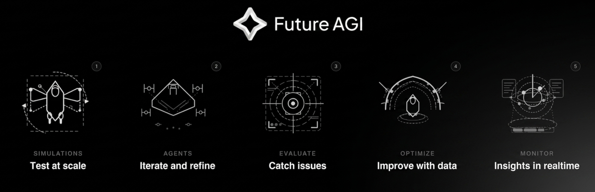
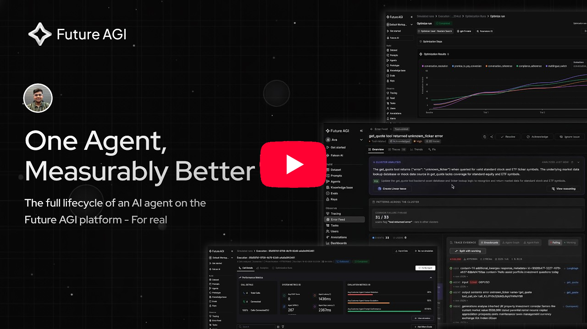

<!--
╔═════════════════════════════════════════════════════════════════════════════╗
║  MARKETING NOTES FOR IMAGE ASSETS                                           ║
║                                                                             ║
║  All images below live under .github/assets/. Specs + intent are inlined   ║
║  above each  tag as HTML comments. Total asset budget < 12 MB.         ║
║  Use PNG for static screenshots, GIF only where called out. Ship light +    ║
║  dark variants via <picture> for any image that contains a UI screenshot    ║
║  (GitHub dark-mode users will see the dark file).                           ║
╚═════════════════════════════════════════════════════════════════════════════╝
-->

> ⚠️ **Nightly release for early testing.** Expect rough edges. Stable version coming out soon — please open an issue if you hit anything.

<div align="center">

<!--
  [MARKETING] logo-banner.png / logo-banner-dark.png
  What:    Full wordmark "Future AGI" + single-line tagline "AI Agents
           hallucinate. Fix it faster." — centered, brand colors.
  Size:    1600 × 400, PNG, transparent background.
  Variants: light + dark; swap via <picture>.
-->
<a href="https://futureagi.com">
  
</a>

# AI Agents hallucinate. Fix it faster.

**The open-source platform for shipping self-improving AI agents.** Evaluations, tracing, simulations, guardrails, gateway, optimization. Everything runs on one platform and one feedback loop, from first prototype to live deployment.

<p>
  <a href="https://github.com/future-agi/future-agi/blob/main/LICENSE"></a>
  <a href="https://pypi.org/project/ai-evaluation/"></a>
  <a href="https://www.npmjs.com/package/@traceai/fi-core"></a>
  <a href="https://discord.com/invite/n2tCUKBkAw"></a>
</p>

<p>
  <a href="https://app.futureagi.com/auth/jwt/register"><b>Try Cloud (Free)</b></a> ·
  <a href="#-quickstart"><b>Self-Host</b></a> ·
  <a href="https://docs.futureagi.com"><b>Docs</b></a> ·
  <a href="https://futureagi.com/blog"><b>Blog</b></a> ·
  <a href="https://discord.com/invite/n2tCUKBkAw"><b>Discord</b></a> ·
  <a href="https://github.com/orgs/future-agi/discussions"><b>Discussions</b></a>
</p>

</div>

---

<!--
  [MARKETING] hero-demo (YouTube)
  Video: https://www.youtube.com/watch?v=6keOTAOUUWI
  GitHub's markdown sanitizer strips <iframe>/<video> but leaves the raw tag
  text behind, so an embed renders as a wall of markup on the repo page. We
  use the video's still frame with a YouTube play button on it, linked to the
  video. The asset filename carries the video ID on purpose: GitHub's image
  CDN caches by URL path, so reusing a filename serves the old picture for
  hours. New video => new ID => new filename => renders immediately.
-->
<div align="center">
  <a href="https://www.youtube.com/watch?v=6keOTAOUUWI">
    
  </a>
</div>

---

## Why Future AGI?

Most AI agents fail in production, and teams end up stitching together evals, observability, and guardrails that never close the loop.
Future AGI collapses all of it into one platform and one feedback loop. Simulate edge cases before launch, evaluate what happens in production, protect users in real time, and turn every trace into signal for the next version.
The result: agents that don't just get monitored, they self-improve.

<table>
<tr>
<td width="33%" valign="top">

###  All-in-one
No more stitching Langfuse + Braintrust + Helicone + Guardrails AI + a custom simulator. One platform covers the lifecycle: **simulate → evaluate → protect → monitor → optimize**, with data flowing back as a loop.

</td>
<td width="33%" valign="top">

###  Open & self-hostable
Apache 2.0 core. Every evaluator, every prompt, every trace is inspectable — **no black-box scoring**. Self-host for data sovereignty or use our managed Cloud. Drop in your own stack at any layer via OTel / OpenAI-compatible HTTP.

</td>
<td width="33%" valign="top">

###  Built for production
Go-based gateway with **~9.9 ns weighted routing**, **~29 k req/s on t3.xlarge**, **P99 ≤ 21 ms with guardrails on**. OpenTelemetry-native traces. 50+ framework instrumentors. Every claim reproducible via the committed benchmark harness.

</td>
</tr>
</table>

---

<!-- Kept so links to the old heading (#-quickstart-60-seconds) still land here. -->
<a id="-quickstart-60-seconds"></a>

## 🚀 Quickstart

Run the whole platform on your own machine in three steps. Rather not run
anything? [Try Cloud free](https://app.futureagi.com/auth/jwt/register).

**You need** Docker Desktop or Docker Engine with Compose, and for the default
Standalone setup **2 vCPUs and 4 GB of memory** given to Docker.

**1. Install**

```bash
git clone https://github.com/future-agi/future-agi.git
cd future-agi
./bin/install          # Windows (PowerShell): .\bin\install.ps1
```

The installer checks your machine, writes this install's secrets to `.env`,
downloads the images (about 800 MB) and waits until everything answers. The
first boot sets up the database and takes a few minutes; <http://localhost:3000>
shows its progress meanwhile.

**2. Sign in and copy your keys**

Open <http://localhost:3000>, create your account (or sign in with the one the
installer made), then copy the API key and secret key from **Keys** in the
sidebar.

**3. Send your first trace**

```bash
pip install fi-instrumentation-otel
export FI_API_KEY="<your API key>" FI_SECRET_KEY="<your secret key>" FI_BASE_URL="http://localhost:4318"
```

```python
from fi_instrumentation import register
from fi_instrumentation.fi_types import ProjectType

tracer_provider = register(project_name="my-first-project", project_type=ProjectType.OBSERVE)
with tracer_provider.get_tracer("quickstart").start_as_current_span("hello-future-agi") as span:
    span.set_attribute("input.value", "Hello, Future AGI")
tracer_provider.force_flush()
```

Open **Tracing** in the sidebar: `my-first-project` holds your first span.
`http://localhost:4318` is this install's trace collector; it listens on this
machine only.

| | **Standalone** (default) | **Distributed** (at scale) |
| --- | --- | --- |
| Install | `./bin/install` | `./bin/install --distributed` |
| Runs | one app container, Postgres, ClickHouse | one container per service, PeerDB, Kafka |
| Docker resources | 2 vCPUs, 4 GB | 4+ vCPUs, 12–16 GB |
| Kubernetes | | [Helm chart](deploy/helm/futureagi) |

- **Configure:** every variable in `.env` is described in
  [docs/configuration.md](docs/configuration.md). Nothing is required for a
  local install; add LLM provider keys, a public URL or email when you need them.
- **Manage:** `docker compose logs -f app`; stop with `docker compose down` or
  `./bin/uninstall` (both keep your data); upgrade with
  `git pull && ./bin/install`; remove everything, data included, with
  `./bin/uninstall --purge`.
- **Develop:** on a branch other than `main`, add `--from-source` to build the
  images from your checkout; `./bin/dev` runs it with hot reload
  ([docs/development.md](docs/development.md)).
- **More:** [INSTALLATION.md](INSTALLATION.md) (every option and
  troubleshooting) and [deploy/README.md](deploy/README.md) (production).

### Instrument your first agent

Swap the hand-made span for an instrumentor to trace a real app, here OpenAI
(`pip install traceai-openai`). Against your own install, keep the `FI_*`
variables from step 3 set.

<table width="100%">
<tr>
<td width="50%">

**Python**
```python
from fi_instrumentation import register
from traceai_openai import OpenAIInstrumentor

register(project_name="my-agent")
OpenAIInstrumentor().instrument()

# Your existing OpenAI code is now traced.
response = client.chat.completions.create(
    model="gpt-4o",
    messages=[{"role": "user", "content": query}],
)
```

</td>
<td width="50%">

**TypeScript**
```typescript
import { register } from "@traceai/fi-core";
import { OpenAIInstrumentation } from "@traceai/openai";

register({ projectName: "my-agent" });
new OpenAIInstrumentation().instrument();

// Your existing OpenAI code is now traced.
const response = await openai.chat.completions.create({
  model: "gpt-4o",
  messages: [{ role: "user", content: query }],
});
```

</td>
</tr>
</table>

<sub> [Full docs →](https://docs.futureagi.com)  ·  [Cookbooks →](https://docs.futureagi.com/docs/cookbook)  ·  [API reference →](https://docs.futureagi.com/docs/api)</sub>

---

## Core features

Six pillars. Each one replaces a tool you probably have.

<table>
<tr>
<td width="33%" valign="top">

### 🧪 Simulate
Thousands of multi-turn conversations against realistic personas, adversarial inputs, and edge cases. Text **and voice** (LiveKit, VAPI, Retell, Pipecat).

<sub>[Docs →](https://docs.futureagi.com/docs/simulation)</sub>

</td>
<td width="33%" valign="top">

### 📊 Evaluate
50+ metrics under one `evaluate()` call: groundedness, hallucination, tool-use correctness, PII, tone, custom rubrics. **LLM-as-judge + heuristic + ML.**

<sub>[Docs →](https://docs.futureagi.com/docs/evaluation)</sub>

</td>
<td width="33%" valign="top">

### 🛡️ Protect
18 built-in scanners (PII, jailbreak, injection, …) + 15 vendor adapters (Lakera, Presidio, Llama Guard, …). Inline in gateway or standalone SDK.

<sub>[Docs →](https://docs.futureagi.com/docs/protect)</sub>

</td>
</tr>
<tr>
<td width="33%" valign="top">

### 👁️ Monitor
OpenTelemetry-native tracing across 50+ frameworks (LangChain, LlamaIndex, CrewAI, DSPy…). Span graphs, latency, token cost, live dashboards. Zero-config.

<sub>[Docs →](https://docs.futureagi.com/docs/observe)</sub>

</td>
<td width="33%" valign="top">

### 🎛️ Agent Command Center
OpenAI-compatible gateway. 100+ providers, 15 routing strategies, semantic caching, virtual keys, MCP, A2A. **~29k req/s, P99 ≤ 21ms with guardrails on.**

<sub>[Docs →](https://docs.futureagi.com/docs/command-center) · [Benchmarks →](./agentcc-gateway/README.md#-benchmarks)</sub>

</td>
<td width="33%" valign="top">

### 🔁 Optimize
Six prompt-optimization algorithms (GEPA, PromptWizard, ProTeGi, Bayesian, Meta-Prompt, Random). Production traces feed back as training data.

<sub>[Docs →](https://docs.futureagi.com/docs/optimization)</sub>

</td>
</tr>
</table>

---

##  Deployment options

<!--
  [MARKETING] deploy-buttons.png  (optional — can stay as inline shields)
  What:    A horizontal row of one-click-deploy badges: Docker · Render ·
           Railway · Fly · AWS Marketplace (coming soon).
  Size:    1400 × 120, PNG — OR keep as inline <a></a> badges below.
-->
<!--
<p align="center">
  <a href="https://render.com/deploy"></a>
  <a href="https://fly.io/docs/launch/"></a>
  <a href="#-quickstart"></a>
</p>
-->
| Target | Status | Notes |
|---|:---:|---|
|  Docker Compose: Standalone | ✅ | `./bin/install`: one app container next to Postgres and ClickHouse, for a laptop or a single VM |
|  Docker Compose: Distributed | ✅ | `./bin/install --distributed`: one container per service, for scale on one host |
|  Production Compose overlay | ✅ | `./deploy/setup.sh` on the Distributed setup: generates secrets, pins image tags, pulls images and starts the stack ([deploy/README.md](deploy/README.md)) |
|  Kubernetes / Helm | ✅ | Distributed on Kubernetes: [`deploy/helm/futureagi`](deploy/helm/futureagi/README.md) |
|  AWS / GCP / Azure | ✅ | Docker Compose on a VM, or the Helm chart on a Kubernetes 1.27+ cluster |
|  AWS Marketplace | ⏳ | Coming soon |
|  Air-gapped / on-prem | ✅ | Mirror the images, set `FUTURE_AGI_TELEMETRY_DISABLED=true` and block outbound traffic ([Telemetry](#telemetry)); [contact sales](mailto:sales@futureagi.com) for support |

Every image, tag and size: [docs/images.md](docs/images.md). Every setting:
[docs/configuration.md](docs/configuration.md).

---

##  Architecture

Every arrow is an open, documented interface: **OpenTelemetry OTLP** for traces, **OpenAI-compatible HTTP** for the gateway, **Postgres / ClickHouse SQL** for storage. Drop in your own stack at any layer.

<!--
  [MARKETING] architecture.svg  (already exists — leave as-is unless re-designing)
  What:    4-band system diagram: client layer → edge (traceAI + gateway)
           → platform (simulate · eval · monitor · optimize) → data layer.
  Size:    ~1400w, vector SVG (existing file 1200×760 in dark palette).
-->
<!-- <picture>
  <source media="(prefers-color-scheme: dark)" srcset=".github/assets/architecture.svg">
  
</picture> -->

**Runtime:** Python 3.11+ (Django 5.1 + Channels) · Go 1.23+ (gateway) · React 18 + Vite · Node 20+.
**Data:** PostgreSQL (metadata) · ClickHouse (spans + time-series) · Redis (state, live updates) · Temporal (jobs).

<details><summary>Component breakdown (per-package)</summary>

| Layer | Component | Code |
|---|---|---|
|  Edge | **traceAI** — OpenTelemetry instrumentation | [`future-agi/traceAI`](https://github.com/future-agi/traceAI) |
|  Edge | **Agent Command Center** — OpenAI-compatible proxy | [`agentcc-gateway/`](./agentcc-gateway) |
|  Platform | **tracer** — OTLP ingest, span graph | [`futureagi/tracer/`](./futureagi/tracer) |
|  Platform | **agentic_eval** — 50+ metrics, LLM-as-judge | [`futureagi/agentic_eval/`](./futureagi/agentic_eval) |
|  Platform | **simulate** — persona-driven scenario generation | [`futureagi/simulate/`](./futureagi/simulate) |
|  Platform | **model_hub** — LLM routing, embeddings, datasets | [`futureagi/model_hub/`](./futureagi/model_hub) |
|  Platform | **accounts · usage · integrations** — auth, orgs, metering, connectors | [`futureagi/accounts/`](./futureagi/accounts) |
|  Data | **PostgreSQL** · **ClickHouse** · **Redis** · **Temporal** | — |

</details>

---

##  SDKs & integrations

Future AGI is an **open-source ecosystem** — each SDK is independently usable, independently packaged, Apache/MIT-licensed.

### Client libraries

| Repo | Install | Languages | Purpose |
|---|---|---|---|
| [**traceAI**](https://github.com/future-agi/traceAI) | `pip install fi-instrumentation-otel`<br>`npm i @traceai/fi-core` | Python · TS · Java · C# | **Zero-config OTel tracing** for 50+ AI frameworks |
| [**ai-evaluation**](https://github.com/future-agi/ai-evaluation) | `pip install ai-evaluation`<br>`npm i @future-agi/ai-evaluation` | Python · TS | **50+ evaluation metrics** + guardrail scanners |
| [**futureagi**](https://github.com/future-agi/futureagi-sdk) | `pip install futureagi` | Python | Platform SDK — datasets, prompts, KB, experiments |
| [**agent-opt**](https://github.com/future-agi/agent-opt) | `pip install agent-opt` | Python | **6 prompt-optimization algorithms** (GEPA, PromptWizard, …) |
| [**simulate-sdk**](https://github.com/future-agi/simulate-sdk) | `pip install agent-simulate` | Python | Voice-agent simulation via LiveKit + Silero VAD |
| [**agentcc**](https://github.com/future-agi/agent-command-center-sdk) | `pip install agentcc`<br>`npm i @agentcc/client` | Python · TS (+ LangChain · LlamaIndex · React · Vercel) | Gateway client SDKs |

### Integrations

<!--
  [MARKETING] integrations-grid.png
  What:    5×4 logo grid, grayscale. Rows roughly: LLM providers,
           frameworks, voice platforms, vector DBs, tools.
           Contents (keep grayscale — colored logos look like an ad):
             LLM:       OpenAI · Anthropic · Google · AWS Bedrock · Azure
             Framework: LangChain · LlamaIndex · CrewAI · AutoGen · DSPy
             Voice:     LiveKit · VAPI · Retell · Pipecat · Deepgram
             Vector:    Pinecone · Qdrant · Weaviate · Chroma · Milvus
             Tools:     OpenTelemetry · Vercel · MCP · A2A · HuggingFace
  Size:    1600 × 800, PNG — OR keep the current 6-row markdown table
           below as fallback.
-->
<!--
<div align="center">
  
</div>
-->
| | |
|---|---|
| **LLM providers (100+)** | OpenAI · Anthropic · Google Gemini · Vertex AI · AWS Bedrock · Azure OpenAI · Mistral · Groq · Cohere · Together · Perplexity · OpenRouter · Fireworks · xAI · Replicate · HuggingFace · + self-hosted **Ollama · vLLM · LM Studio · TGI · Llamafile** |
| **Agent frameworks** | LangChain · LangGraph · LlamaIndex · CrewAI · AutoGen · Phidata · PydanticAI · Claude SDK · LiteLLM · Haystack · DSPy · Instructor · Smol-agents |
| **Voice platforms** | VAPI · Retell · LiveKit · Pipecat |
| **Vector DBs** | Pinecone · Weaviate · Chroma · Milvus · Qdrant · pgvector |
| **Tools & infra** | Vercel AI SDK · n8n · MongoDB · MCP · A2A · Guardrails AI · Langfuse · HuggingFace Smol-agents |

<sub> [Full integrations catalog →](https://docs.futureagi.com/docs/integrations)</sub>

---

##  How Future AGI compares

<table width="100%">
<thead>
<tr>
<th width="25%"></th>
<th width="15%" align="center"><b>Future&nbsp;AGI</b></th>
<th width="15%" align="center">Langfuse</th>
<th width="15%" align="center">Phoenix</th>
<th width="15%" align="center">Braintrust</th>
<th width="15%" align="center">Helicone</th>
</tr>
</thead>
<tbody>
<tr><td>Open source</td><td align="center">✅<br><sub>Apache 2.0</sub></td><td align="center">✅<br><sub>MIT</sub></td><td align="center">✅<br><sub>Elastic v2</sub></td><td align="center">❌</td><td align="center">✅<br><sub>Apache 2.0</sub></td></tr>
<tr><td>Self-host</td><td align="center">✅</td><td align="center">✅</td><td align="center">✅</td><td align="center">❌</td><td align="center">✅</td></tr>
<tr><td>LLM tracing (OpenTelemetry)</td><td align="center">✅</td><td align="center">✅</td><td align="center">✅</td><td align="center">✅</td><td align="center">⚠️<br><sub>via OpenLLMetry</sub></td></tr>
<tr><td>Evaluation suites</td><td align="center">✅<br><sub>50+ metrics</sub></td><td align="center">✅</td><td align="center">✅</td><td align="center">✅</td><td align="center">⚠️<br><sub>Limited</sub></td></tr>
<tr><td><b>Agent simulation</b></td><td align="center">✅</td><td align="center">❌</td><td align="center">❌</td><td align="center">❌</td><td align="center">❌</td></tr>
<tr><td><b>Voice agent eval</b></td><td align="center">✅</td><td align="center">❌</td><td align="center">⚠️<br><sub>Cookbook</sub></td><td align="center">❌</td><td align="center">❌</td></tr>
<tr><td><b>LLM gateway built in</b></td><td align="center">✅<br><sub>100+ providers</sub></td><td align="center">❌</td><td align="center">❌</td><td align="center">✅</td><td align="center">✅</td></tr>
<tr><td><b>Guardrails built in</b></td><td align="center">✅<br><sub>18 + 15 adapters</sub></td><td align="center">❌</td><td align="center">❌</td><td align="center">❌</td><td align="center">❌</td></tr>
<tr><td><b>Prompt optimization</b></td><td align="center">✅<br><sub>6 algorithms</sub></td><td align="center">❌</td><td align="center">❌</td><td align="center">❌</td><td align="center">❌</td></tr>
<tr><td>Prompt management</td><td align="center">✅</td><td align="center">✅</td><td align="center">✅</td><td align="center">✅</td><td align="center">✅</td></tr>
<tr><td>Datasets & experiments</td><td align="center">✅</td><td align="center">✅</td><td align="center">✅</td><td align="center">✅</td><td align="center">✅</td></tr>
<tr><td>No-code eval builder</td><td align="center">✅</td><td align="center">⚠️</td><td align="center">⚠️</td><td align="center">⚠️</td><td align="center">⚠️</td></tr>
</tbody>
</table>

<sub>Based on publicly-documented features as of April 2026. Corrections welcome — open a PR.</sub>

---

## Built for every kind of agent

<!--
  [MARKETING] use-cases-band.png  (optional — lightweight)
  What:    Seven small tile icons in a horizontal band: headset (support),
           phone (voice), briefcase (internal), magnifier (RAG),
           robot (autonomous), mouse pointer (CUA), code (coding).
  Size:    1600 × 200, PNG — OR keep as emoji bullets below.
-->

- **Customer Support:** Ship support AI that customers actually trust
- **Voice Agents:** Test, evaluate, and improve voice AI end-to-end
- **Internal Tools:** AI copilots your whole org can rely on
- **RAG & Search:** Every answer grounded, every citation verified
- **Autonomous Agents:** Multi-step agents you can actually trust in production
- **Computer-Use Agents (CUA):** Agents that click with confidence
- **Coding Agents:** AI that writes code you can actually ship

---

##  Roadmap

[**Vote on the public roadmap →**](https://futureagi.com/roadmap)  ·  [**GitHub Discussions**](https://github.com/orgs/future-agi/discussions/categories/roadmap)  ·  [**Releases**](https://github.com/future-agi/future-agi/releases)  ·  [**Changelog**](https://docs.futureagi.com/docs/release-notes)

<table>
<tr>
<th width="25%"> Recently shipped</th>
<th width="25%"> In progress</th>
<th width="25%"> Coming up</th>
<th width="25%"> Exploring</th>
</tr>
<tr valign="top">
<td>

- [x] Prompt optimization engine
- [x] Taxonomy-based Feed Clustering
- [x] Agent Runs in Dataset Experiments
- [x] Simulate from Production Calls
- [x] LiveKit Configuration via UI
- [x] System Metric Filtering for Voice
- [x] Agent Playground
- [x] Dashboards
- [x] Access platform via MCP
- [x] Annotation Queues
- [x] Command Center
- [x] Open source Future AGI stack
- [x] Eval Explanation Output Size Control 


</td>
<td>

- [ ] Agent Changelog & Diff View
- [ ] Smart Queue Assignment
- [ ] Essential Node Library for Agent Builder
- [ ] Full Execution Tracing for Agents
- [ ] Multi-modal Support for Agents

</td>
<td>

- [ ] Agent Changelog & Diff View
- [ ] Smart Queue Assignment

</td>
<td>

- [ ] Import agents to Agent Playground
- [ ] Simulating CUA agents
- [ ] Simulating Coding agents
- [ ] Scheduled Simulations

</td>
</tr>
</table>

---

## 🤝 Contributing

We love contributions — bug fixes, new evaluators, framework integrations, docs, examples, anything.

1.  [Browse `good first issue`](https://github.com/future-agi/future-agi/issues?q=is%3Aissue+is%3Aopen+label%3A%22good+first+issue%22)
2.  Read the [Contributing Guide](CONTRIBUTING.md)
3.  Say hi on [Discord](https://discord.com/invite/n2tCUKBkAw) or [Discussions](https://github.com/orgs/future-agi/discussions)
4.  Sign the CLA on your first PR (automatic bot)

<!--
  [MARKETING] contributors-wall.png  — SKIP UNTIL 50+ CONTRIBUTORS.
  Stub is intentionally left out. Revisit once contrib count justifies
  an avatar wall (contrib.rocks auto-generates when enabled).
-->

---

## 🌍 Community & support

| | |
|---|---|
| 💬 [**Discord**](https://discord.com/invite/n2tCUKBkAw) | Real-time help from the team and community |
| 🗨️ [**GitHub Discussions**](https://github.com/orgs/future-agi/discussions) | Ideas, questions, roadmap input |
| 🐦 [**Twitter / X**](https://x.com/FutureAGI_) | Release announcements |
| 📝 [**Blog**](https://futureagi.com/blog) | Engineering & research posts |
| 📺 [**YouTube**](https://www.youtube.com/@Future_AGI) | Walkthroughs & demos |
| 📊 [**Status**](https://status.futureagi.com) | Cloud uptime + incident history |
| 📧 **support@futureagi.com** | Cloud account / billing |
| 🔐 **security@futureagi.com** | Private vulnerability disclosure (24h ack — see [SECURITY.md](SECURITY.md)) |

---

##  Telemetry

Self-hosted Future AGI sends deployment telemetry, **on by default**, so we can count installs and size release testing. **No trace data, no prompts, no completions, no datasets, no API keys**, ever.

**What is sent:**
- **Registration** (once, when the first account is created): a random instance ID, the version, the deployment type, and the **email addresses and domains** of the organization owners and admins (and of any Django staff or superuser accounts).
- **Heartbeat** (every 6 hours): aggregate usage counts, such as traces, spans and evaluations.

The app logs a `deployment_telemetry_disclosure` line saying what it sends and where. To opt out, install with `./bin/install --no-telemetry`, or set `FUTURE_AGI_TELEMETRY_DISABLED=true` in `.env` (`deploy/.env.production` for the production overlay, `config.telemetry=false` for Helm) and run `docker compose up -d`. The instance then sends one minimal registration (instance ID, version, deployment type, timestamp, **no emails**) and no heartbeats. For no connection to Future AGI at all, also block outbound traffic to `api.futureagi.com`; [docs/telemetry.md](docs/telemetry.md) lists every outbound connection, including litellm's model price list (`LITELLM_LOCAL_MODEL_COST_MAP=True` keeps it offline).

Everything else that could leave your install (HubSpot, Slack, Mixpanel, PostHog, reCAPTCHA, Sentry, Mailgun) is **off until you set its key**. Exact payloads and every setting: [docs/telemetry.md](docs/telemetry.md).

---

## ⭐ Star history

<a href="https://star-history.com/#future-agi/future-agi">
  <picture>
    <source media="(prefers-color-scheme: dark)" srcset="https://api.star-history.com/svg?repos=future-agi/future-agi&type=Date&theme=dark">
    
  </picture>
</a>

---

## 📄 License

Future AGI is licensed under the **Apache License 2.0**. See [LICENSE](LICENSE) and [NOTICE](NOTICE).

**You own your evaluation logic and your data.** Inspect every evaluator, every prompt, every trace — no black-box scoring, no vendor lock-in.

---

<div align="center">

**Built with ❤️ by the Future AGI team and [contributors worldwide](https://github.com/future-agi/future-agi/graphs/contributors).**

If Future AGI helps you ship better AI, a ⭐ helps more teams find us.

[🌐 futureagi.com](https://futureagi.com) · [📖 docs.futureagi.com](https://docs.futureagi.com) · [☁️ app.futureagi.com](https://app.futureagi.com) · [📊 status.futureagi.com](https://status.futureagi.com)

</div>
