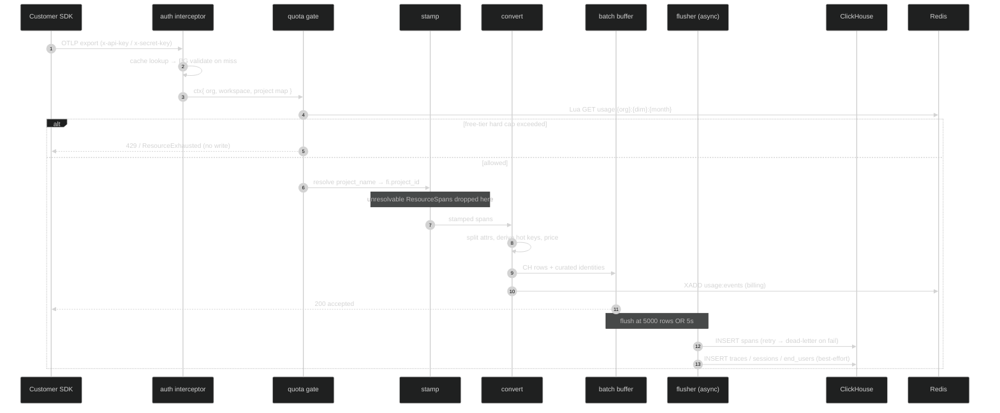
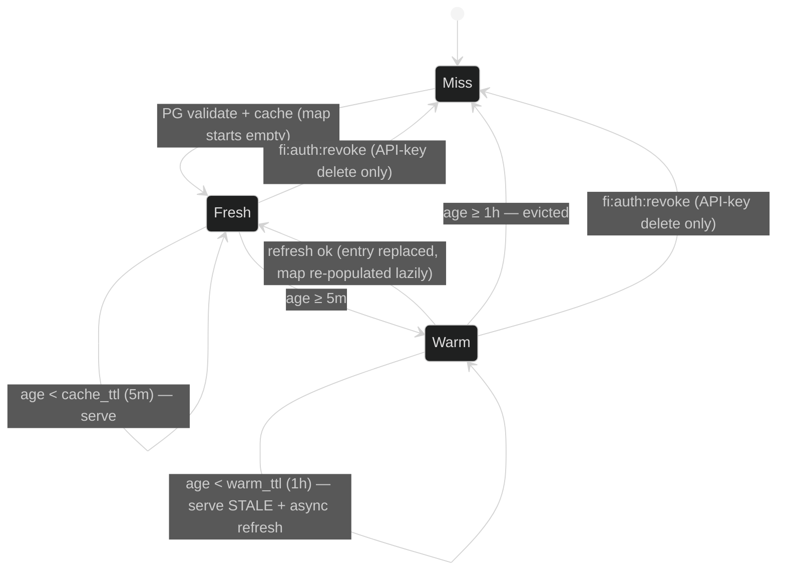
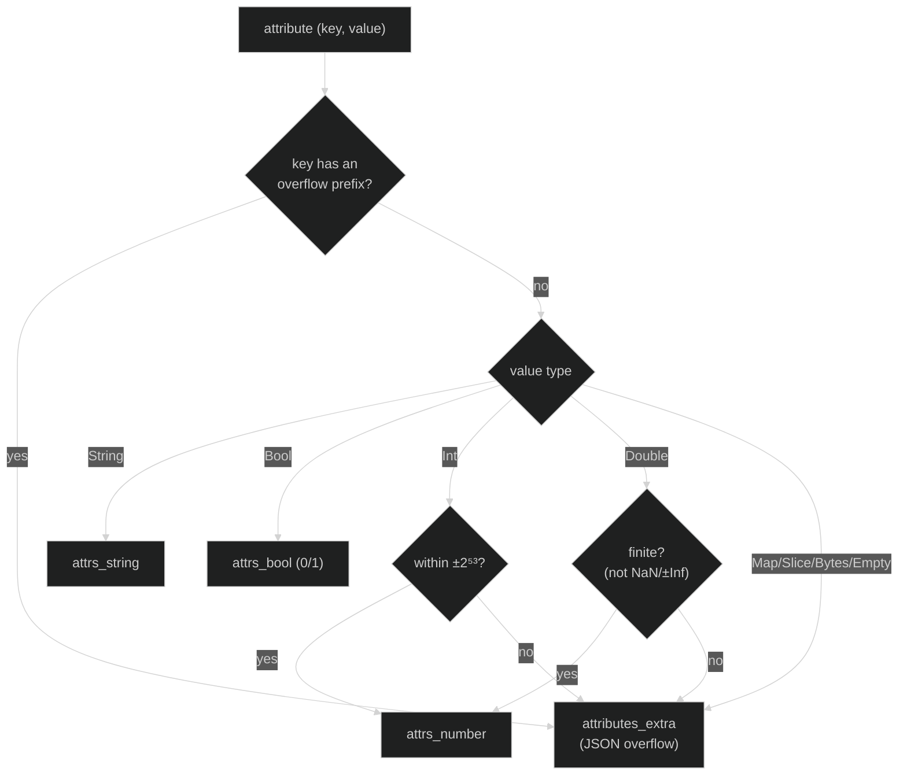

# fi-collector — Architecture Reference

The FutureAGI OpenTelemetry span ingest collector. This document explains how
the whole binary works end-to-end: the request pipeline, authentication and the
project-resolution cache, every use of Redis, pricing/cost, usage metering and
billing, and the ClickHouse write path — plus the known failure modes.

> Scope: `fi-collector/` (Go) and the parts of the Django backend
> (`futureagi/`) it shares state with. File:line citations are given so each
> claim can be checked against source. Line numbers drift; treat them as
> anchors, not guarantees.

---

## Contents

1. [What it is and why it exists](#1-what-it-is-and-why-it-exists)
2. [Deployment modes](#2-deployment-modes)
3. [Configuration](#3-configuration)
4. [Request pipeline (end to end)](#4-request-pipeline-end-to-end)
5. [Authentication & project resolution](#5-authentication--project-resolution)
6. [Redis](#6-redis)
7. [Pricing / cost](#7-pricing--cost)
8. [Usage metering & billing](#8-usage-metering--billing)
9. [ClickHouse write path](#9-clickhouse-write-path)
   — including the [attribute-split transform](#91-attribute-splitting--the-core-transform)
10. [Operating & debugging](#10-operating--debugging)
11. [Known behaviours & open issues](#11-known-behaviours--open-issues)
12. [Appendix — package map](#appendix--package-map)

---

## 1. What it is and why it exists

`fi-collector` is the production write path for the ClickHouse 25.3 `spans`
store. It replaces the old
`SDK → Django OTLP → Redis → Celery → PG → PeerDB → CH 24.10 → spans_mv` chain,
whose CH-side materialized view exploded attribute rows and OOM'd the cluster.

The attribute-splitting that used to run inside ClickHouse now runs in this Go
binary at ingest time, with bounded per-batch memory, targeting ~1B spans/day.

**It is _not_ a standard OpenTelemetry Collector distribution.** It imports only
`go.opentelemetry.io/collector/pdata` (the data model), not the collector
service framework — a deliberate choice to keep the image ~22 MB and cold start
< 100 ms. The "receiver / processor / exporter" roles are filled by hand-written
packages, not factory-registered components (`pkg/server/server.go:1-14`,
`go.mod`).

### High-level flow

```
Customer SDK (OTLP gRPC :4317  |  OTLP/HTTP :4318)
   │
   ▼
fi-collector
   ├─ auth interceptor         API key/secret → org, workspace, project map
   ├─ quota gate (checkUsage)  Redis Lua read; reject over-limit free-tier
   ├─ stamp (StampResourceAttrs) resolve project_name → fi.project_id
   ├─ convert (ConvertWithIdentities) OTLP → CH row(s); split attrs; price
   ├─ enqueue                  park rows on in-process batch buffer
   └─ emitUsage                XADD usage:events (billing)
   │
   ▼ (async flusher: 5000 rows or 5 s)
ClickHouse 25.3
   ├─ spans          (pinned; retried; dead-lettered on failure)
   ├─ traces         (best-effort curated write)
   ├─ trace_sessions (best-effort curated write)
   └─ end_users      (best-effort curated write)
```

---

## 2. Deployment modes

Same binary, three shapes (`EMBEDDED.md`, `Dockerfile`,
`docker-compose.standalone.yml`):

1. **Standalone** (default, recommended for prod) — its own pod/container,
   two replicas per region behind the LB on `:4317`. Independent scaling and
   failure domain.
2. **Embedded sidecar** — same image as a sidecar in the Django backend pod;
   the app's internal OTel SDK targets `localhost:4317` for loopback latency.
   Tied to the backend pod lifecycle.
3. **Supervised subprocess** — Django launches and supervises the process for
   one-binary, non-Kubernetes deploys.

**Image**: multi-stage `golang:1.24-alpine` build (`CGO_ENABLED=0`,
`-trimpath -ldflags="-s -w"`) → `distroless/static-debian12:nonroot`.
`EXPOSE 4317 4318`, `VOLUME /var/lib/fi-collector` (dead-letter queue),
runs as `nonroot`. The distroless image has no shell, so the container
healthcheck is disabled and `/healthz` is scraped from the host.

**Ports**: `4317` OTLP gRPC, `4318` OTLP/HTTP, `9464` admin (`/healthz`,
`/metrics`).

---

## 3. Configuration

One YAML file, baked into the image at `/etc/fi-collector/config.yaml`
(`config/collector.yaml`). Precedence: **built-in defaults < YAML < `FI_*` env
vars** (`cmd/fi-collector/main.go:10-14`, `applyEnvOverrides` at `:172-214`).

| Block | Key | Default | Env override | Notes |
|---|---|---|---|---|
| `writer` | `url` | `http://clickhouse:8123` | `FI_CH_URL` | CH HTTP endpoint |
| | `database` / `table` | `default` / `spans` | `FI_CH_DATABASE` | |
| | `max_retries` | `5` | | span insert retries (6 attempts total) |
| | `initial_backoff`/`max_backoff` | `100ms`/`10s` | | exponential + jitter |
| | `request_timeout` | `30s` | | |
| | `dead_letter_file` | `/var/lib/fi-collector/dead_letter.jsonl` | `FI_DEAD_LETTER_FILE` | on retry exhaustion |
| | `async_insert` | `false` | | Go batching is the backpressure, not CH async |
| `server` | `grpc_addr` | `:4317` | `FI_GRPC_ADDR` | |
| | `http_addr` | `:4318` | `FI_HTTP_ADDR` | `disable`/`off` turns it off |
| | `batch_max_rows` | `5000` | | flush trigger |
| | `batch_max_age` | `5s` | | flush trigger |
| `auth` | `pg_write` | — | `FI_PG_WRITE` | **required**; absence = fatal exit |
| | `pg_read` | falls back to `pg_write` | `FI_PG_READ` | point at a read replica in prod |
| | `cache_ttl` | `5m` | | auth-cache fresh window |
| | `warm_ttl` | `1h` | | auth-cache stale-serve window |
| | `redis_addr` | `""` | `FI_AUTH_REDIS_ADDR` | empty → quota + metering disabled |

**Feature gating is by presence, not flags**:

- Auth is active iff `pg_write` is set (`pkg/auth/config.go:16-18`). Without it,
  spans land with an empty (randomised) `project_id` and are unqueryable.
- Redis presence gates both quota enforcement and usage metering
  (`main.go:68-88`). No Redis → ingestion is never blocked and usage is silently
  not counted.
- Pricing is gated on a loaded rate table + PG (`main.go:90-98`).

---

## 4. Request pipeline (end to end)

Both transports decode an OTLP `ExportTraceServiceRequest` and run the identical
sequence. Order: **auth → quota check → stamp → convert → enqueue → emit usage**
(`pkg/server/server.go`).



**gRPC** (`otlpHandler.Export`, `server.go:247-274`):

1. `GRPCInterceptor` (`pkg/auth/interceptor.go:31-62`) reads `x-api-key` +
   `x-secret-key` from metadata, calls `Authenticate`, and stores the
   `ResolveResult` + cache key in the context.
2. `checkUsage` (`server.go:248`) — quota gate; over-limit →
   `codes.ResourceExhausted "quota exceeded"`. No spans written.
3. `StampResourceAttrs` (`server.go:255`) — resolve `project_name` → project id,
   stamp `fi.project_id` + `fi.org_id`; drop unresolvable ResourceSpans.
4. `ConvertWithIdentities` (`server.go:264`) — OTLP → CH rows + curated
   identities + costs.
5. `enqueue` (`server.go:268`) — park rows on the in-process buffer.
6. `emitUsage` (`server.go:271`) — billing emission.

**HTTP** (`handleHTTPTraces`, `server.go:293-383`): routes `POST /v1/traces` and
`POST /tracer/v1/traces`, accepts `application/x-protobuf` and
`application/json` (16 MiB body cap). Auth via `HTTPMiddleware`
(`pkg/auth/middleware.go`) supporting both `X-Api-Key`/`X-Secret-Key` headers
and `Authorization: Basic base64(api:secret)` (Langfuse compatibility). Same
step order, except the body is decoded before the quota check; over-limit →
HTTP `429`.

### Batching / flushing

A single-goroutine flusher (`server.go:407-483`):

- `enqueue` appends rows under a mutex and merges curated identities. It kicks
  the flusher when `len(pend) >= batch_max_rows` (5000).
- `flushLoop` also fires on a `batch_max_age` ticker (5 s).
- `drainNow` atomically swaps the buffer, calls `writer.Insert` (spans, with
  retry + dead-letter), then best-effort `curated.Write` (traces / sessions /
  end_users).
- Shutdown drains once; in-flight loss is bounded to the last 5 s
  (at-least-once boundary).

---

## 5. Authentication & project resolution

All auth state is **in-process** — a `sync.Map` cache plus singleflight; PG is
the source of truth, queried directly (`pkg/auth/auth.go:3-5`). Redis is _only_
an invalidation signal (see §6), never a data source.

### The cache

- **Key**: `sha256(apiKey + ":" + secretKey)` hex (`pkg/auth/cache.go:11-14`).
- **Value** (`ResolveResult`, `pkg/auth/pgresolver.go:15-22`): `OrgID`,
  `WorkspaceID`, `UserID`, `KeyType`, and `Projects` — a
  `project_name → project_id` map, protected by a mutex.
- **Freshness** (`cache.go:46-61`): `fresh` if age < `cache_ttl` (5 m) → serve
  immediately; `warm` if age < `warm_ttl` (1 h) → serve stale **and** kick an
  async background refresh; else `miss` → full PG re-validate.
- Only valid keys are cached (invalid keys always hit PG, deduplicated by
  singleflight) to bound memory against credential scanners.



> The `Warm` self-loop is the important one: a `project_name → id` mapping can be
> served **stale for up to `warm_ttl` (1 h)** after the underlying project
> changes, because the async refresh only takes effect on the _next_ request and
> nothing but an API-key revocation evicts early. A project delete is not a
> key revocation, so it is invisible to this machine — the root of issue #1 in
> §11.

### Project resolution and auto-create

`StampResourceAttrs` (`pkg/auth/stamp.go:18-80`) requires every ResourceSpan to
carry `project_name`, resolves the names via `ResolveProjectsForKey`
(`auth.go:148-186`), stamps `fi.project_id`/`fi.org_id`, and **drops** spans
whose project name can't be resolved.

Resolution order inside `ResolveProjectsForKey`:

1. Serve any name already in the cached `Projects` map.
2. Batch-resolve unknown names from PG:
   `SELECT ... WHERE organization_id=$1 AND name=ANY($2) AND deleted=false`
   (`pgresolver.go:157`) — via the **read pool** (`pg_read`, a replica in prod).
3. Auto-create any still-missing name via `GetOrCreateProject`
   (`pgresolver.go:179-225`): `INSERT ... ON CONFLICT (name, trace_type,
   organization_id, workspace_id) WHERE NOT deleted DO UPDATE ... RETURNING id`.
   `trace_type` is hardcoded `"observe"` (`auth.go:174`); default workspace is
   resolved when the key isn't workspace-scoped.

> **Load-bearing subtlety.** The resolve SELECT filters `deleted=false` but
> **not** `trace_type`/`workspace`, while create keys on all four columns. An
> org with two same-name projects of different types (e.g. an `observe` and an
> `experiment` "RAG") can have the resolve return either id — a real
> misattribution source. See §9.

---

## 6. Redis

Redis is optional (`main.go:68-74`); when `redis_addr` is empty the client is
nil and every Redis path no-ops. The collector uses the bare go-redis default
DB 0, no password/TLS. The backend uses a full `REDIS_URL` — **both must point
at the same instance/DB** for the shared keys and channel to line up.

### 6.1 Pub/sub — cache invalidation

One channel: **`fi:auth:revoke`**.

- **Publisher (backend)**: `_publish_key_revocation`
  (`accounts/views/keys.py:21-33`) publishes `sha256(api_key:secret_key)` — i.e.
  the exact collector cache key — on **API key disable/delete only** (`keys.py:257`,
  `:344`). Fire-and-forget.
- **Subscriber (collector)**: `WatchRevocations` (`auth.go:64-83`) does
  `cache.m.Delete(msg.Payload)` — a point-delete of that one cache entry.

Because the payload _is_ the cache key, the delete is a one-to-one match. Note
this only covers **key** revocation — there is currently **no publish on project
delete**, which is the root of the project-split incident in §9.

### 6.2 Usage stream (append)

`usage:events`, `XADD` with `MAXLEN ~1,000,000` (`pkg/auth/usage.go:16-17`,
`93-99`). One entry per ingest call; fields `event_id`, `org_id`, `event_type`,
`timestamp`, `amount`, `properties`. The Django emitter
(`ee/usage/services/emitter.py`) writes the **same stream with the same schema**;
a Temporal consumer drains both.

### 6.3 Counters and flags the collector reads

| Key | Purpose | Written by | TTL | Collector access |
|---|---|---|---|---|
| `usage:{org}:{dim}:{YYYY-MM}` | monthly usage counter | backend consumer `INCRBYFLOAT` (`consumer.py:204-206`) | 31 d | **read** via Lua `GET` (`metering.go:90-92`) |
| `plan:{org}` | org plan string | backend + collector | 5 min | read + `SETEX` (`metering.go:128-151`) |
| `pause:{org}:{dim}` | budget-pause flag | backend `budget_enforcement.py:213` | 35 d | **read** (`metering.go:112-113`) |
| `tracing_billing_mode:{org}` | storage vs events | backend + collector | 5 min | read (`billingmode.go`) |

The collector never increments the usage counter — it only reads it during the
quota gate. The counter is advanced post-facto by the stream consumer, which
creates a deliberate eventual-consistency gap (see §8).

### 6.4 Failure modes

- **Quota/metering — fail open.** Any Redis error (or nil client) →
  `Allowed=true` (`metering.go:72`, `97-99`). Ingestion is never blocked by a
  Redis outage.
- **Usage emission — fail silent.** `XADD` errors are logged, not returned
  (`usage.go:100-102`); usage for that window is simply lost.
- **Revocation — degrades to TTL.** If the watch can't run, key revocation falls
  back from instant to `cache_ttl`-bounded eventual eviction.

---

## 7. Pricing / cost

Per-span cost is computed in Go, mirroring the retired Django
`calculate_cost_from_tokens` (`pkg/pricing/`).

**Chain** (`pricer.go:21-34`) — gate: `model != "" AND (prompt > 0 OR completion > 0)`:

1. **Static litellm table** (`table.go`): a vendored `model_prices.json` snapshot
   (`//go:embed`, overridable via `FI_PRICING_JSON`). Exact model-key lookup;
   `cost = prompt*inRate + completion*outRate`, with a `*_above_128k_tokens`
   tier selected when prompt tokens exceed 128 000. Malformed entries are skipped
   and counted, not fatal.
2. **Per-org custom pricing** (`custom.go`): PG lookup
   `model_hub_customaimodel WHERE organization_id=$1 AND user_model_id=$2 AND
   deleted=false`; rates are **per-1K-token** (`prompt*(in/1000) +
   completion*(out/1000)`). TTL-cached per `org+model`, with a 45 s negative-cache
   on transient DB errors and a query context detached from the request (500 ms).

**Token/model derivation** happens upstream in `adapter.DeriveHotKeys`
(`pkg/adapter/adapter.go:212-271`), which aliases across FI / OTel GenAI /
OpenLLMetry / OpenInference conventions (e.g. model from `llm.model_name` →
`gen_ai.request.model` → …; prompt tokens from `llm.token_count.prompt` →
`gen_ai.usage.input_tokens` → …).

**Stamping** (`converter.go:285-294`): a user-supplied cost attribute wins —
`cost := hot.Cost`, and only if `!hot.CostUserSet && pricer != nil` does the
pricer override. An explicit user cost of `0` is respected. The result lands in
the `cost` column of the CH `spans` row (never PG).

---

## 8. Usage metering & billing

Two emitters — the Go collector (hot path) and Django (legacy/eval/gateway) —
share **one** Redis stream (`usage:events`) and **one** consumer that drains it
into Postgres + Redis counters.

### Two orthogonal axes

- **Tracing billing mode** (what dimension ingestion bills), per-org from
  `usage_organizationsubscription.tracing_billing_mode`, default `storage`
  (`pkg/auth/billingmode.go`):
  - `storage` → `event_type=observe_add`, `amount = payloadBytes`.
  - `events` → `event_type=tracing_event`, `amount = numTraces + numSpans`.
- **Plan** (whether the quota is a hard cap): `free` is hard-capped; `payg`,
  `boost`, `scale`, `enterprise`, `custom` are soft (allow and bill overage).
  The collector encodes this as `hardCapPlans = {"free": true}`
  (`metering.go:29`).

### The quota gate (`CheckUsage`, `metering.go:73-124`)

Resolves the plan (`plan:{org}` cache → PG, default `free`), and for hard-capped
free orgs runs an atomic **read-only** Lua check against
`usage:{org}:{dim}:{YYYY-MM}`, returning deny if `current + amount > limit`. Free
allowances are hardcoded — `tracing_events: 50,000`, `storage: 50 GiB`
(`metering.go:24-27`) — matching `ee/billing.yaml`. It also checks the
`pause:{org}:{dim}` flag. **Fail-open** on any error.

### The meter (`EmitIngestion`, `usage.go:55-91`)

Resolves the billing mode, then a single `XADD usage:events`, keyed on
**`org_id` only** (no project/workspace attribution). Dedup uses a deterministic
UUIDv5 `event_id` for single-trace exports (provider-pull re-polls bill once) and
a random UUID for multi-trace SDK batches.

### Backend consumer (`ee/usage/services/consumer.py`)

`XREADGROUP` batches of 5000, dedupes on `event_id` against the append-only
`UsageEventLog` ledger, `INCRBYFLOAT` the monthly counter (+31 d expire), upserts
`UsageSummary`, evaluates budgets, then `XACK`. Subscription state lives in
`OrganizationSubscription`; limits/pricing in `PlanEntitlement` / `PlanPricing`;
Stripe deltas via `reported_to_stripe`.

---

## 9. ClickHouse write path

### 9.1 Attribute splitting — the core transform

This is the reason the collector exists. A raw OTel span carries an arbitrary
attribute bag; ClickHouse 25.3 stores it as **three typed Maps plus a JSON
overflow tier**, and that split used to run inside CH as a materialized view
that exploded rows and OOM'd the cluster. `pkg/adapter` now does it in Go at
ingest, allocation-light (it writes into caller-owned maps reused across spans),
as a byte-exact port of the Python `pg_to_ch_adapter.py:split_attributes` so
backfilled and live rows are indistinguishable downstream.

**Destinations** (`adapter.Split`, `adapter.go:53-114`):

| CH column | Type | Gets |
|---|---|---|
| `attrs_string` | `Map(String, String)` | string values |
| `attrs_number` | `Map(String, Float64)` | ints (within ±2⁵³) and finite doubles |
| `attrs_bool` | `Map(String, UInt8)` | booleans as `0`/`1` |
| `attributes_extra` | `String` (JSON) | everything else — overflow tier |

**Routing rules** (order matters):



- **Overflow-prefix keys always go to overflow**, whatever their scalar type
  (`overflowKeyPrefixes`, `adapter.go:31-40`): `llm.prompt`, `llm.completion`,
  `llm.messages`, `input.value`, `output.value`, `retrieval.documents`,
  `embedding.embeddings`. These are LLM message/content payloads — often
  string-shaped but really nested, per-row-variable objects; keeping them out of
  the typed Maps bounds those Maps' key cardinality.
- **Bool is checked before Int** (a spec rule mirrored from Python for
  legibility).
- **Large ints demote to overflow** rather than lose Float64 precision
  (`±9007199254740992`); **non-finite doubles** (NaN/±Inf) go to overflow as a
  JSON string rather than corrupt the Float64 Map.
- `OverflowToJSON` serialises to `"{}"` when empty. CH 25.x typed JSON
  **auto-flattens dotted keys server-side**: `{"a.b": 1}` is stored as
  `{"a":{"b":1}}` and queried via `attributes_extra.a.b.:Int64`.

**Hot-key promotion** (`DeriveHotKeys`, `adapter.go:212-271`): after the split,
GenAI/OpenInference semconv keys are pulled into first-class columns — `model`,
`provider`, `gen_ai_system`, token counts, user-supplied `cost` — aliasing
across conventions (`llm.model_name` → `gen_ai.request.model` → …). Some of these
are CH `MATERIALIZED` columns; the collector derives them in Go for the ones that
aren't materialized or where the CH derivation would be too lossy.

**`observation_type`** (`resolveObservationType`, `converter.go:107-135`): taken
from span-kind attribute keys, falling back to operation-name keys, then
lowercased/trimmed and mapped through a synonym table; unresolved → `"unknown"`.

### 9.2 Span → row (`converter.go`)

`ConvertWithIdentities` walks ResourceSpans → ScopeSpans → Spans once. Resource
attrs supply `service.name`, `fi.project_id` → `projectID`, `fi.org_id` →
`orgID`, `fi.semconv`, `project_type`. **A conversion error aborts the whole
batch — no silent per-span drop** (`converter.go:195-197`).

`spanToRow` (`:268-408`) maps ~35 columns. Notable ones:

- `project_id` = `coalesceUUID(projectID)` — a **random v4 UUID** if empty, since
  the column is non-nullable; this keeps a misconfigured/unauthenticated producer
  from dropping the row but scatters it to an un-navigable id.
- `id` = lowercase 16-hex span id; `trace_id` = 36-char dashed UUID.
- `end_user_id` / `trace_session_id` = `Nullable(UUID)` from the span identity
  (below).
- `model`, `provider`, `prompt_tokens`, `completion_tokens`, `total_tokens`,
  `cost` from the hot-key + pricer step.
- `attrs_string` / `attrs_number` / `attrs_bool` + `attributes_extra` (overflow)
  from `adapter.Split`.
- `_version` = start-time nanos (UInt64); **`is_deleted` = hardcoded `0`**.

### 9.3 Curated dimensions (traces / sessions / end_users)

`collectTrace` (`:213-258`) derives the `traces` row from the **root span**
(`parent_span_id == ""`), gated on: the _uncoalesced_ `fi.project_id` being a
valid UUID (rejects randomised orphans), a non-zero trace id, and a non-zero
`_version`.

`newSpanIdentity` (`:477-518`) computes the end-user and session ids once per
span and reuses them for both the span columns and the curated rows, so keys are
byte-identical. End-user derivation requires `project_type == "observe"` + valid
project/org UUIDs + a truthy `user.id`; session derivation only requires a valid
project + a present `session.id`.

**Deterministic ids** (`pkg/detid/detid.go`) are UUIDv5 (SHA-1) over frozen
key strings — `EndUserID = uuid5(NSEndUser, "{project}|{org}|{user}|{type}")`,
`TraceSessionID = uuid5(NSSession, "{project}|{name}")` — a byte-exact mirror of
the Python `deterministic_id.py` so collector-written and Django-written rows
consolidate onto one id without a hot-path PG round trip.

### 9.4 Table engines

| Table | Engine | Partition | Order by |
|---|---|---|---|
| `spans` | `ReplacingMergeTree(_version, is_deleted)` | `toDate(start_time)` | `(project_id, observation_type, service_name, toStartOfHour(start_time), trace_id, id)` |
| `traces` | `ReplacingMergeTree(_version, is_deleted)` | `toYYYYMM(created_at)` | `(project_id, id)` |
| `end_users` | `ReplacingMergeTree(version)` DateTime64 | — | `(project_id, end_user_id)` |
| `trace_sessions` | `ReplacingMergeTree(version)` DateTime64 | — | `(project_id, trace_session_id)` |

`project_id` **leads every sort key** — the multi-tenancy boundary. This is why
a span's project can't be changed in place (it's part of the primary key); a
re-attribution is an insert of new rows, not an update.

Two version conventions coexist: `spans`/`traces` use integer-nanos `_version`
(UInt64); `end_users`/`trace_sessions` use a DateTime64 `version = now()`.

### 9.5 Materialized views that fan out from `spans` on insert

Despite the original "no insert-time MV on spans" rule, five AggregatingMergeTree
rollup MVs now fire on every span insert block:

- `spans_per_session_mv` → `spans_per_session`
- `spans_hourly_rollup_mv` → `spans_hourly_rollup`
- `trace_count_rollup_mv` → `trace_count_rollup`
- `span_user_rollup_mv` → `span_user_rollup`
- `dashboard_attr_rollup_mv` → `dashboard_attr_rollup`

> **Operational consequence.** Any manual `INSERT ... SELECT` re-ingest of spans
> (e.g. a data-repair re-attribution) re-fires all five MVs and **double-counts**
> into the rollups; a lightweight `DELETE` does not decrement them (MVs don't
> fire on delete). Data repairs must account for the rollups explicitly.

### 9.6 Retries, dead-letter, and the write/meter ordering

- **Span path** (`chwriter.Insert`): up to `max_retries` (5) with exponential
  backoff + jitter. 4xx except 429 is non-retryable → straight to dead-letter.
  On exhaustion, each row is appended (fsync'd) to `dead_letter.jsonl`; only a
  failed dead-letter write is a hard error. "No silent drops."
- **Curated path** (`InsertBestEffort`): a single POST, **no retry, no
  dead-letter** — deliberately, so a curated-RMT outage can't stall span
  draining or pollute the span dead-letter file. Gaps are reconciled by the
  Django `ch25_backfill_curated_dimensions` job.
- **Metering is decoupled from write durability**: `emitUsage` runs right after
  `enqueue`, before the async flusher confirms the CH insert. A batch that later
  dead-letters is still billed. (Dead-lettered rows are meant to be replayed, so
  this is "bill then eventually write," not "bill then lose" — but the two are
  not transactional.)

---

## 10. Operating & debugging

### Health and metrics

The admin server listens on `:9464` (`main.go:107`). **Only `/healthz` is
actually wired** (`runAdmin`) — the `/metrics` in the config comment is not
implemented; the writer's stats are exposed only in the `/healthz` JSON body and
logged once at shutdown. Don't expect a Prometheus scrape endpoint.

`/healthz` returns `200` normally and `503 {"status":"unhealthy"}` iff
`BatchesInserted + BatchesFailed > 100` **and** `BatchesFailed*2 > that sum` —
i.e. a sustained **>50% span-batch failure rate over a ≥100-batch sample**. It is
span-only: curated-write failures never trip it.

The stats object (`chwriter.Stats`, surfaced in `/healthz`):

| Field | Meaning |
|---|---|
| `BatchesInserted` / `RowsInserted` | successful span inserts |
| `BatchesRetried` | span batches that hit ≥1 retry |
| `BatchesFailed` | span batches that exhausted retries → dead-lettered |
| `RowsDeadLettered` | rows written to the dead-letter file |
| `CuratedBatchesInserted` / `CuratedBatchesFailed` | best-effort curated path (never affects `/healthz`) |

### Dead-letter queue

On span-insert retry exhaustion (or a non-retryable 4xx), each row is appended
(fsync'd) to `/var/lib/fi-collector/dead_letter.jsonl` — one span row per line in
JSONEachRow form, replayable as `INSERT INTO spans`. A growing file (or rising
`RowsDeadLettered`) means CH is rejecting or unreachable. The volume is
bind-mounted so it survives restarts.

### Log lines worth grepping (structured slog)

- `dropped ResourceSpans with unresolvable project` — spans whose `project_name`
  didn't resolve were **dropped, not written**.
- `project auto-create failed` — a name couldn't be resolved *or* created.
- `background key refresh failed` — warm-cache refresh couldn't reach PG.
- XADD warnings from `pkg/auth/usage.go` — usage for that window was silently
  lost (metering is fire-and-forget).

### Debugging playbook

| Symptom | Where to look |
|---|---|
| SDK gets `429` / `ResourceExhausted` | Free-tier quota gate (§8). Check `usage:{org}:{dim}:{month}` counter and `plan:{org}`. |
| Span accepted (200) but not visible | (a) `project_name` unresolvable → dropped (grep the log); (b) auth disabled or missing `fi.project_id` → `coalesceUUID` stamped a **random** `project_id`, so the row exists under an un-navigable project; (c) batch dead-lettered → check `dead_letter.jsonl` + `BatchesFailed`; (d) landed under a deleted/duplicate project (§11 #1–2). |
| Billing looks wrong / doubled | `usage:events` stream is org-keyed; cross-emitter dedup only holds for single-trace exports (§8, §11 #7). |
| Collector reports `503` | Sustained CH insert failures — check CH reachability and dead-letter growth. |
| No usage counted at all | Redis unset or down → metering fail-silent. Check `FI_AUTH_REDIS_ADDR`. |

### Running locally

`docker compose -f fi-collector/docker-compose.standalone.yml up` brings up the
collector + CH 25.3; point an SDK at `localhost:4317` (gRPC) or `localhost:4318`
(HTTP). CH HTTP is on `localhost:18123`.

---

## 11. Known behaviours & open issues

### 11.1 Current behaviour & constraints

Real behaviours in production or evident in the code — worth knowing before
changing anything here. Items marked ⚙ have an active fix direction in §11.2.

1. ⚙ **Project delete doesn't invalidate the collector cache.** `fi:auth:revoke`
   fires only on API-key change, not project delete. After a project is deleted,
   cached `project_name → id` maps keep resolving to the dead id for up to the
   `warm_ttl` window (1 h, not 5 min — the warm path serves stale before the
   async refresh lands). A delete-then-recreate can split one trace across the
   dead id and a freshly auto-created replacement. Fix direction: publish a
   `project_id`-keyed invalidation on delete and evict by map _value_ (id is
   globally unique; name-based eviction collides across orgs and races the
   recreate). Pair with a short project-map TTL because pub/sub is at-most-once.

2. ⚙ **Deletion never propagates to ClickHouse.** `_soft_delete_projects`
   (`tracer/views/project.py`) is PG-only. Spans already written under a deleted
   project keep `is_deleted=0` and remain live and billable — just unreachable
   in the UI. (Observed: tens of thousands of live spans under deleted projects,
   much of it voice/VAPI ingested for months after deletion via persisted
   webhook linkage that also never checks project liveness.)

3. ⚙ **Read-replica lag defeats naive invalidation.** Project resolution uses the
   `pg_read` replica; a re-resolve immediately after a delete can still see the
   project as live and re-cache the dead id. Convergence ultimately depends on a
   reconciliation job, not the event alone.

4. ⚙ **Resolve/create asymmetry** (`pgresolver.go:157` vs `:210`): the resolve
   SELECT ignores `trace_type`/`workspace`; an org with same-name projects of
   different types can get either id stamped. Add the missing filters to make it
   deterministic.

5. ⚙ **`project_id` misattribution has no read-side guard.** The trace-detail read
   path resolves a trace's project from `spans` with an unscoped `LIMIT 1` and a
   `deleted=false` gate, so a span copy under a deleted/foreign project makes the
   whole trace 400. The durable fix is to treat `(project_id, trace_id)` as the
   real key — `trace_id` is not globally unique.

6. **Storage-mode quota gate mismatch.** `checkUsage` always gates on
   `("tracing_event", 1)` regardless of the org's billing mode
   (`server/usage.go:31`); storage-mode orgs are metered on bytes but not
   quota-checked on their storage counter — enforcement relies on the async
   `pause:` flag.

7. ⚙ **Dual-emitter double-billing risk.** Both the collector and Django can emit
   span-ingestion usage; cross-emitter dedup only holds when both send the same
   `event_id`, which the collector sets deterministically **only for
   single-trace** exports. Multi-trace batches traversing both paths can
   double-bill.

8. **Quota counter lag.** The gate reads a counter advanced only after the stream
   consumer processes events, so burst traffic can overshoot a hard cap before
   the counter catches up.

9. **Fail-open, org-keyed billing.** With Redis down, nothing is blocked and
   usage is lost; the collector never checks payment status (unpaid orgs keep
   ingesting); and all ingestion usage is keyed on `org_id` alone — no
   per-project/workspace attribution.

### 11.2 Open issues & planned fixes

Design directions under discussion for the ⚙ items above. Not yet shipped;
numbers reference §11.1.

- **Project-delete cache invalidation** (#1). Publish a `project_id`-keyed
  message on delete (a new channel, not `fi:auth:revoke`) and evict by map
  *value* via a `sync.Map` scan — the id is globally unique, whereas name-based
  eviction collides across orgs and races the recreate. An `orgID → {cacheKey}`
  (or `projectID → {cacheKey}`) secondary index makes eviction
  O(keys-in-org) instead of O(all-entries). Pair with a short project-map TTL,
  because pub/sub is at-most-once and the read pool lags (#3).
- **CH deletion propagation + reconciliation** (#2). An async job tombstones a
  deleted project's CH `spans`/`traces`, plus a periodic job that diffs CH
  project ids carrying live spans against live PG projects — the real backstop,
  since events can be missed.
- **Deterministic resolution** (#4). Add `trace_type`/workspace filters to the
  resolve SELECT so the cached map can't hold the wrong same-name id.
- **Read-side identity** (#5). Treat `(project_id, trace_id)` as the real key:
  accept a `project_id` param, resolve within the caller's visible projects
  instead of an unscoped `LIMIT 1`, render span-less traces, and return `404`
  not `400`.
- **Voice/VAPI linkage** (related, not collector-cache). The webhook attributes
  via persisted `AgentDefinition → project` linkage that checks provider
  liveness but not project liveness — needs a project-liveness check +
  cascade-unlink on delete. No collector change touches this path.
- **Cross-emitter dedup** (#7). Emit a deterministic `event_id` for multi-trace
  batches too, so the collector and Django never double-bill the same spans.

---

## Appendix — package map

| Path | Role |
|---|---|
| `cmd/fi-collector` | main binary; config load, wiring, admin server, revocation watch |
| `cmd/loadgen` | deterministic OTLP fabricator / benchmark seeder |
| `cmd/parity` | attribute-split parity harness vs the Python splitter |
| `pkg/server` | OTLP gRPC + HTTP receiver, batching flusher, request orchestration, usage hooks |
| `pkg/auth` | API-key auth, project resolution, cache, quota metering, usage emission, revocation watch |
| `pkg/adapter` | split OTLP attrs into typed CH maps + `attributes_extra` overflow; derive hot LLM keys |
| `pkg/pricing` | token-cost pricer (embedded litellm table + per-org custom PG rates) |
| `pkg/detid` | deterministic UUIDv5 surrogate ids for curated dimensions |
| `pkg/curatedwriter` | best-effort dual-write of end_users / trace_sessions / traces RMTs |
| `pkg/chwriter` | batched CH HTTP JSONEachRow writer; retry / backoff / dead-letter |
| `exporter/clickhouse25exporter` | OTLP pdata → CH `spans` row-map converter |
