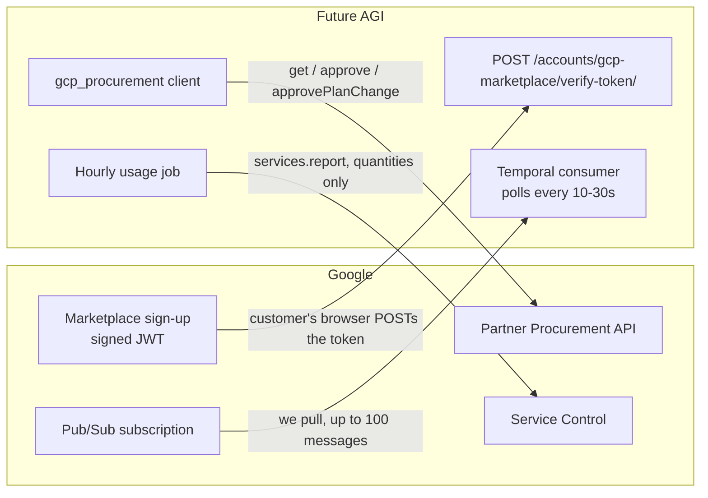
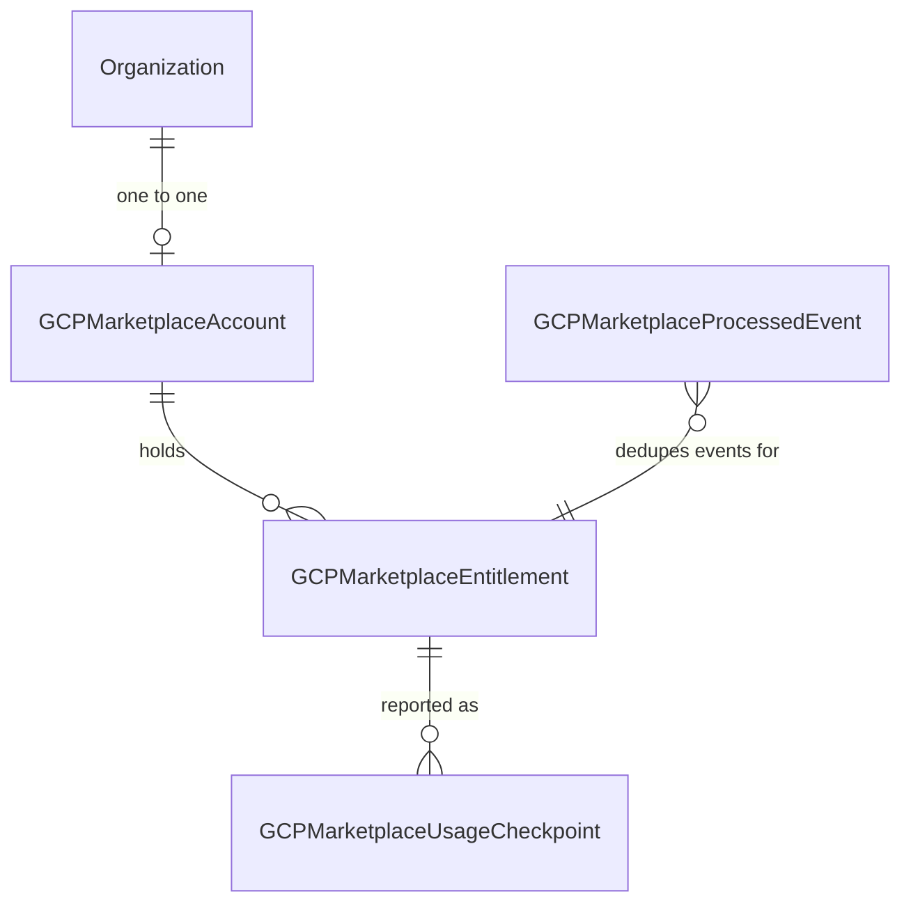
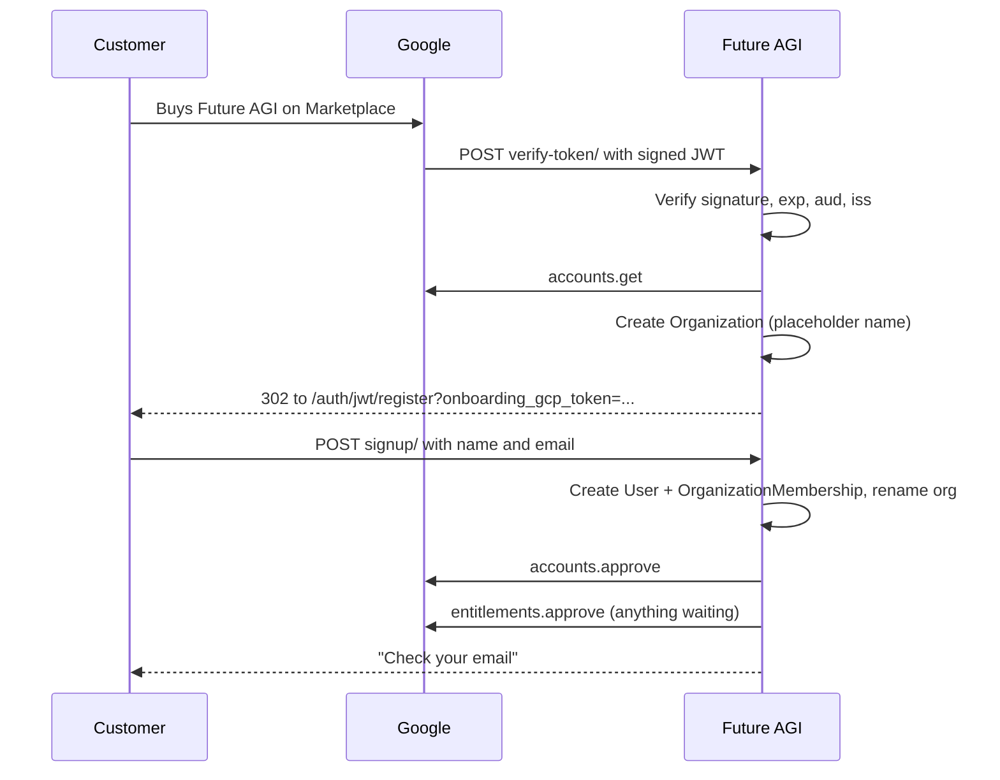
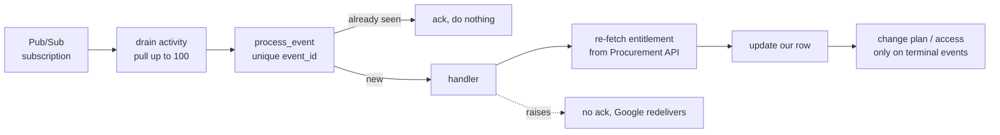
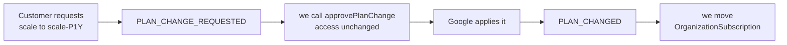
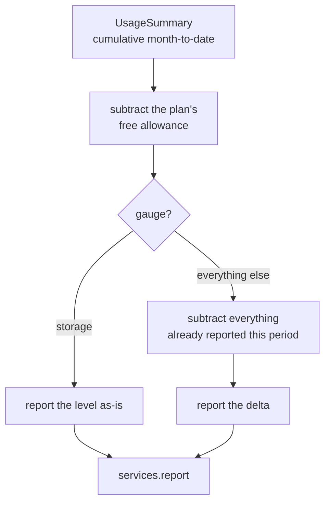

# GCP Marketplace Integration

How a customer buys Future AGI on Google Cloud Marketplace, how their purchase reaches
our database, and how their usage gets onto Google's invoice.

Read top to bottom the first time. Sections 1 to 3 are context, 4 to 7 are the mechanism,
8 to 9 are the billing maths, and 12 is what still does not work.

---

## 1. What GCP Marketplace is

A sales channel where the customer buys our product from **Google**, not from us.

Google is the *merchant of record*. That single fact drives every design decision here:

| | Direct customer | Marketplace customer |
| --- | --- | --- |
| Who takes payment | We do, via Stripe | Google does |
| Who sets the price | Us, in our own config | Us, in Google's Producer Portal |
| What we send out | An invoice | A **quantity**, nothing more |
| Who chases non-payment | We do | Google does |
| Where the customer manages the subscription | Our pricing page | The Google Cloud console |

The customer's Google Cloud bill gains a line for Future AGI. Google collects, takes its
cut, and pays us. We never see a card number and never issue an invoice.

The practical consequence: **whatever number we report becomes the customer's bill, with
no review step in between.** There is no draft invoice a human looks at. This is why so
much of the code below is about not reporting the same usage twice.

---

## 2. The three APIs, and the one thing that is not an API

These are easy to conflate. They are separate Google services with separate endpoints,
separate client objects and separate purposes.

| Purpose | Service | Direction | Our client |
| --- | --- | --- | --- |
| Read and approve accounts and entitlements | Partner Procurement API (`cloudcommerceprocurement`) | We call out | `accounts/services/gcp_procurement.py` |
| Report usage for billing | Service Control (`servicecontrol`) | We call out | `accounts/services/gcp_service_control.py` |
| Learn that something changed | Cloud Pub/Sub | We pull | `tfc/temporal/marketplace/activities.py` |
| Prove a customer arrived from Marketplace | Not an API. A signed JWT Google POSTs to us | Google calls in | `accounts/gcp_marketplace_utils.py` |

Neither Procurement nor Service Control has a purpose-built Python library. Both use the
generic `google-api-python-client`, which builds the call surface at runtime from
Google's machine-readable description of the REST API. So `providers().entitlements()
.approve()` does not exist anywhere in our code or in the library; it is generated. The
REST reference **is** our API documentation, mapped one to one.

---

## 3. Vocabulary

Five words carry the whole feature. Getting them straight up front saves a lot of
confusion later.

| Term | What it is |
| --- | --- |
| **Account** | The customer. One per customer per provider. Created when they first click through from Marketplace. Carries no name, email or company: Google tells us nothing about who they are. |
| **Entitlement** | One purchase of one plan. An account can hold several. This is the thing that gets approved, activated, changed and cancelled. |
| **Plan** | What they bought, as an id like `payg` or `scale-P1Y`. The `-P1Y` suffix is Google's annual variant. |
| **Offer** | A negotiated deal (a private offer for Enterprise). The economics live on the offer, on Google's side. We never read a discount or a committed amount. |
| **Consumer id** | The `usageReportingId` field on an entitlement. Service Control needs it to know whose usage this is. It only appears once the entitlement goes active, and without it we cannot bill at all. |

---

## 4. How Google and our server communicate

Four channels, in two directions.



Note the directions. Google **never calls our API** except for that one sign-up POST.
Everything else is us reaching out, including the events: Google publishes to a topic and
we pull from a subscription we own.

### Authentication, per direction

**Inbound (the sign-up token).** Google POSTs a JWT, and this endpoint is unauthenticated
and provisions paid accounts, so every check matters. We verify the RS256 signature
against the certs Google publishes, plus expiry, audience and issuer, and require a
non-empty subject. An unverified `sub` would be a free-subscription vulnerability.

The decoded payload:

```json
{
  "iss": "https://www.googleapis.com/robot/v1/metadata/x509/cloud-commerce-partner@system.gserviceaccount.com",
  "iat": 1757000000,
  "exp": 1757000300,
  "aud": "futureagi.endpoints.futureagiprimary.cloud.goog",
  "sub": "PROCUREMENT_ACCOUNT_ID",
  "google": { "roles": ["..."], "user_identity": "OBFUSCATED_USER_ID" }
}
```

Tokens live five minutes. `sub` names the subscription; `google.user_identity` names the
person. We store both.

**Outbound (Procurement and Service Control).** A service account,
`gcp-marketplace-integration@futureagiprimary`. On GKE this resolves through Workload
Identity with no key file anywhere; for local development `GCP_MARKETPLACE_SA_JSON` holds
the key JSON. The non-obvious requirement is that the service account must also be
**linked to all three integrations in Producer Portal**. IAM roles alone are not enough,
and the resulting permission errors do not say so.

### What is configured on Google's side

| Setting | Value |
| --- | --- |
| Sign up URL | `https://<our-api>/accounts/gcp-marketplace/verify-token/` |
| Login URL | `https://<our-app>/auth/jwt/login` |
| Pub/Sub topic (Google's) | `projects/cloudcommerceproc-prod/topics/futureagiprimary` |
| Our subscription | Created in our own project, pull mode |

---

## 5. The data model

Four tables, in `accounts/models/gcp_marketplace.py`.



**`gcp_marketplace_account`** is the customer. `procurement_account_id` is unique and is
what every lookup uses. `organization` is nullable because the row is created before we
know anything about the human. `google_user_identity` holds the obfuscated Google user id
from the sign-up token: Google supplies it exactly once, at sign-up, and it cannot be
retrieved later.

**`gcp_marketplace_entitlement`** is one purchase. Three fields carry the weight:

- `usage_reporting_id` is the consumer id. No consumer id, no billing.
- `google_update_time` is the staleness guard. Pub/Sub has no ordering guarantee, so a
  delayed event could otherwise overwrite newer state. Any fetch older than what we hold
  is discarded.
- `plan_id` versus `new_pending_plan` encodes an in-flight plan change: what they are on
  now, and what they have asked to move to.

**`gcp_marketplace_usage_checkpoint`** is one report of one metric for one window.

**`gcp_marketplace_processed_event`** is the Pub/Sub dedupe ledger.

### The two idempotency guarantees

Both are enforced by database constraints, not by application logic. That is deliberate.

**Each event is handled once.** Pub/Sub delivery is at-least-once, and the ack deadline
can expire while a handler is still running, so two workers can hold the same message
simultaneously. A `get_or_create` on the unique `event_id`, inside the same transaction as
the handler, is what makes this safe. Checking "have we seen this?" in Python first would
lose the race.

**Each window is billed once.** Google documents **no deduplication on `operationId`**,
and its own reference implementation sends a random UUID. So retrying a usage report is
not idempotent on Google's side. The unique constraint on
`(entitlement, metric, window_start)` in our own table is the only thing preventing a
double charge.

### What we store from Google's resources

Google's `Entitlement` has 25 fields. We keep 11 as columns and the rest in `raw_payload`.

| Google field | Our column |
| --- | --- |
| `name` | `entitlement_id` (bare id, not the full path) |
| `account` | `account` FK |
| `plan` | `plan_id` |
| `newPendingPlan` | `new_pending_plan` |
| `state` | `status` |
| `usageReportingId` | `usage_reporting_id` |
| `createTime` | `effective_at` |
| `subscriptionEndTime` | `expires_at` |
| `offer` | `offer` |
| `offerEndTime` | `offer_end_time` |
| `cancellationReason` | `cancellation_reason` |
| `updateTime` | `google_update_time` |

Deliberately not stored as columns: `newPendingOffer`, `offerDuration`, `orderId`,
`consumers[]`, `messageToUser`, `entitlementBenefitIds[]`. All are in `raw_payload` if
ever needed.

---

## 6. Sign-up flow

This is the only synchronous, customer-facing part of the feature.



### Step by step

**Google POSTs the token.** The Sign up URL registered in Producer Portal is our
`verify-token/` endpoint. It is form-encoded, and Google expects a redirect back.

**We create the organization before we know who the customer is.** Google supplies no
name, email or company, so the org gets a placeholder like `GCP Marketplace a1b2c3d4`,
renamed once the form is submitted. The AWS path names the org from the customer's AWS
account id; there is no GCP equivalent.

**The redirect carries an opaque handle, not data.** `onboarding_gcp_token` is a random
128-bit value; the actual session (`procurement_account_id`) sits in Redis under that key
with a 15 minute TTL. Nothing sensitive travels through the browser, the token is deleted
after use, and expiry is free. Two branches: if the org already has members we redirect to
login instead, because this is a returning customer.

**Approval happens at sign-up, not on the redirect.** Google's documentation is explicit:
*"After the user has successfully signed up, your app must call the Partner Procurement
API and indicate that the account has been approved."* An account approval is a statement
of fact, that this person now has an account with us. At redirect time they have only
landed on a form.

**"Continue with Google" works too.** The onboarding token rides the OAuth `state`
parameter out to Google and back, because `state` is the only field returned untouched. On
return, the callback runs the same `process_signup` rather than creating a second
organization.

**The whole flow is safe to repeat.** A customer can click through from the Marketplace
console any number of times: the account row is fetched not recreated, the org is only
created when the FK is null, and approval is skipped once granted.

---

## 7. Lifecycle events

Everything after sign-up arrives as a Pub/Sub message. Handlers live in
`accounts/gcp_marketplace_events.py`.



### Two rules every handler follows

**1. Never trust the message body.** It carries an event type and an id, nothing more.
Every handler re-fetches current state from the Procurement API, so a message redelivered
an hour late still produces today's answer.

**2. Only terminal events change access.** `*_REQUESTED` and `*_PENDING_*` are
notifications: the customer has asked for something that has not happened yet. Acting on
them would revoke access people are still paying for.

### The 15 event types

| Event | What we do |
| --- | --- |
| `ACCOUNT_ACTIVE` | Mirror state |
| `ACCOUNT_DELETED` | Unlink the organization (see section 12) |
| `ENTITLEMENT_CREATION_REQUESTED` | Approve, or hold if sign-up has not completed |
| `ENTITLEMENT_ACTIVE` | **Apply the plan. Billing starts here.** Capture the consumer id |
| `ENTITLEMENT_OFFER_ACCEPTED` | Apply the plan (private offer, resolves to enterprise) |
| `ENTITLEMENT_PLAN_CHANGE_REQUESTED` | Approve the pending plan. Access unchanged |
| `ENTITLEMENT_PLAN_CHANGED` | **Apply the plan.** The change has taken effect |
| `ENTITLEMENT_PLAN_CHANGE_CANCELLED` | Mirror state |
| `ENTITLEMENT_PENDING_CANCELLATION` | Mirror state. They keep access until term end |
| `ENTITLEMENT_CANCELLATION_REVERTED` | Mirror state |
| `ENTITLEMENT_CANCELLING` | Mirror state |
| `ENTITLEMENT_CANCELLED` | **Downgrade to free**, hand billing back to card |
| `ENTITLEMENT_RENEWED` | Apply the plan. Moves the billing period boundary |
| `ENTITLEMENT_OFFER_ENDED` | Mirror state |
| `ENTITLEMENT_DELETED` | Mirror state |

An unrecognised event type logs and acks rather than raising. One new event type from
Google would otherwise redeliver forever and fill the dead-letter queue.

### Plan changes are two phase

This is the part most easily got wrong.



Approving and applying are separate events, potentially separated by time. Collapsing them
would upgrade or downgrade someone before Google has agreed the change took effect.

The `approvePlanChange` call must echo back the entitlement's `newPendingPlan`, not its
current plan. That value is read from Google microseconds earlier, never from the event
body, because the customer can cancel or change the request between the event and our
handler running.

Cancellation follows the same shape: `PENDING_CANCELLATION` means they have asked and will
keep access until the end of the billing cycle. Only `CANCELLED` drops them to free, and
customer data is untouched.

---

## 8. Plans and metrics

### Plan map

Google's plan id maps to our internal plan and billing interval. An unmapped id raises
rather than defaulting: a plan renamed in the portal should fail loudly, not quietly put
someone on the wrong tier.

| Marketplace plan | Our plan | Interval |
| --- | --- | --- |
| `payg` | payg | monthly |
| `scale` | scale | monthly |
| `scale-P1Y` | scale | annual |
| `enterprise` | enterprise | monthly |
| `enterprise-P1Y` | enterprise | annual |

PAYG is monthly only: a $0 platform fee leaves nothing to prepay annually. Private offers
still arrive against one of these ids, since the negotiated economics live on the offer.

### Metric ids differ per plan

Metric ids are unique per product in Producer Portal, so the same dimension has a
different id on every plan. Always report against the id belonging to the plan on the
entitlement.

| Dimension | payg | scale | enterprise |
| --- | --- | --- | --- |
| `ai_credits` | `payg_credits` | `scale_credits` | `enterprise_credits` |
| `storage` | `payg_storage` | `scale_storage` | `enterprise_storage` |
| `gateway_requests` | `gateway_request` | `scale_gateway_request` | `enterprise_gateway_request` |
| `gateway_cache_hits` | `payg_cache_hits` | `scale_cache_hits` | `enterprise_cache_hits` |
| `text_sim_tokens` | `payg_text_simulation` | `scale_text_simulation` | `enterprise_text_simulation` |
| `voice_sim_minutes` | `payg_voice_simulation` | `scale_voice_simulation` | `enterprise_voice_simulation` |

Two things worth flagging. `gateway_request` under payg carries no plan prefix: the naming
is not a pattern, it is a list. And the `-P1Y` variants reuse their base plan's metric ids.

**Tracing is absent throughout.** It is excluded from Marketplace billing by decision.

### The six dimensions

| Dimension | Type sent | Shape |
| --- | --- | --- |
| `ai_credits` | `int64Value` (as a string) | counter |
| `gateway_requests` | `int64Value` | counter |
| `gateway_cache_hits` | `int64Value` | counter |
| `text_sim_tokens` | `int64Value` | counter |
| `storage` | `doubleValue` | **gauge** |
| `voice_sim_minutes` | `doubleValue` | counter |

Only storage and voice simulation accept floating point. Sending a double where Google
expects an int64 is rejected per operation, and note that int64 values go over the wire as
**strings**, which is protobuf's JSON mapping rule for 64-bit integers.

---

## 9. How a usage number is computed

`accounts/gcp_marketplace_usage.py` is an adapter, not a second metering system.
Quantities come from `UsageSummary`, which is already the source for Stripe reporting, and
go out unchanged. No GCP-specific rates, no recalculation, no discounts applied here: a
private offer's economics live on the Marketplace offer, and applying them twice would
undercharge.

The problem it solves: `UsageSummary` holds a **cumulative month-to-date total**. Google
wants **what was consumed during a window**.



### Worked example, `ai_credits` on a plan with a 10,000 allowance

| Hour | Ledger (cumulative) | Billable after allowance | Already reported | Sent |
| --- | --- | --- | --- | --- |
| 13:00 | 8,000 | 0 | 0 | nothing |
| 14:00 | 11,000 | 1,000 | 0 | **1,000** |
| 15:00 | 11,400 | 1,400 | 1,000 | **400** |
| 16:00 | 11,400 | 1,400 | 1,400 | nothing |

Subtracting the allowance from the cumulative total handles the crossover on its own:
nothing is reported until usage passes it, then only the excess.

### Four details that matter

**The free allowance is applied on our side.** Marketplace plans carry a flat per-unit
rate with no allowance configured on Google's side. Without this subtraction a Marketplace
customer would be charged from the first unit while a direct customer on the same plan
gets the same allowance free.

**Storage is a gauge, not a counter.** It is held rather than consumed, so a window delta
is meaningless. We report the point-in-time level and let Google accumulate it over the
billing period.

**Windows are contiguous.** Each window starts where the last one ended, which is what
Google's guide asks for: *"the `startTime` of a report Operation should have the same
value as the `endTime` of the previous."*

**Checkpoints are written before the API call.** If the process dies mid-call there is
still a `pending` row recording that we tried. Pending is the dangerous state: we called
Google and never learned the outcome, so we do not know whether the customer was billed.
Retrying risks double billing and skipping risks losing revenue, so these are surfaced for
a human rather than resolved automatically.

### What the request looks like

```json
{
  "operations": [{
    "operationId": "3f2a1c8e-...",
    "operationName": "usage_report_Acme-Corp_2026-09-03T13:00:00Z_2026-09-03T14:00:00Z",
    "consumerId": "<usageReportingId>",
    "startTime": "2026-09-03T13:00:00Z",
    "endTime": "2026-09-03T14:00:00Z",
    "metricValueSets": [
      { "metricName": "<service>/scale_credits", "metricValues": [{ "int64Value": "1000" }] },
      { "metricName": "<service>/scale_storage", "metricValues": [{ "doubleValue": 42.5 }] }
    ],
    "userLabels": { "environment": "prod", "region": "us" }
  }]
}
```

One call carries all six dimensions as a single operation, so one `operationId` covers
every checkpoint in the batch.

**HTTP 200 does not mean accepted.** Per-operation failures come back in a `reportErrors`
array inside a successful response. Treating a 200 as success would mark usage reported
that Google rejected, and it would never be billed and never be noticed.

### Reconciliation

A second, daily job compares the ledger against what we recorded as reported, and logs any
difference.

It exists because **under-reporting is silent**. No customer complains about being charged
too little, so nothing else would ever surface it. Over-reporting reaches them as a wrong
invoice; under-reporting reaches nobody. It also counts checkpoints stuck `pending` for
more than six hours.

---

## 10. Runtime

### Temporal in one minute

Temporal is a durable execution engine, used here as a Celery replacement. Two building
blocks:

- An **activity** is an ordinary function that does the real work: network calls, database
  writes. It can fail and Temporal retries it.
- A **workflow** is orchestration only. Because Temporal replays it from history after a
  crash, workflow code must be deterministic: no network, no `datetime.now()`, no
  `random`, no normal logging.

A **worker** polls a **task queue** and can only run what has been registered on it. If
nothing is registered, or no worker listens on that queue, the work sits there silently.

### The two runtime shapes

**Event consumer, a long-lived workflow.** `GCPMarketplaceConsumerWorkflow` loops forever:
call the drain activity, wait, repeat. The activity pulls up to 100 messages
synchronously, handles each, and acks only the ones whose transaction committed. A failed
message keeps its ack id out of the batch, so Google redelivers it while the rest of the
batch completes.

It cannot be a single blocking `subscribe()` call, because an activity has to return and a
workflow cannot do I/O at all. The workflow calls `continue_as_new` every 500 iterations:
history grows with each step, and an unbounded loop would eventually produce a history too
large to replay.

Polling cadence: 10 seconds after a batch with events, 30 seconds when idle.

**Usage reporting, two cron schedules.** Each fires, runs, and finishes.

| Schedule | Cron | Catch-up window | What it does |
| --- | --- | --- | --- |
| `gcp-marketplace-usage-report` | `5 * * * *` | 6 hours | Report the current window for every active entitlement |
| `gcp-marketplace-usage-reconcile` | `30 2 * * *` | 24 hours | Compare the ledger against what we reported |

The catch-up windows matter: without them, a firing missed during a deploy or an outage is
silently dropped rather than run late.

---

## 11. Configuration

### Environment variables

| Variable | Used for | Read by |
| --- | --- | --- |
| `GCP_MARKETPLACE_PROVIDER_ID` | Builds every Procurement resource name | `gcp_procurement.py` |
| `GCP_MARKETPLACE_SERVICE_NAME` | Service Control service, metric name prefix, **and the JWT audience** | `gcp_service_control.py`, `gcp_marketplace_utils.py` |
| `GCP_MARKETPLACE_PROJECT_ID` | Project holding the Pub/Sub subscription | `activities.py` |
| `GCP_MARKETPLACE_PUBSUB_SUBSCRIPTION` | Subscription name | `activities.py` |
| `GCP_MARKETPLACE_SA_JSON` | Local dev only. Empty on GKE, which uses Workload Identity | both service clients |

They cannot collapse into fewer. They are set in three different places (Producer Portal,
the Pub/Sub console, IAM) and change independently. In a test integration the provider id
is prefixed `DEMO-`, and the subscription often lives in a different project from the
service.

Failure modes differ too, which is why each raises its own error: a missing provider id
breaks approvals only, a missing service name breaks both usage reporting and sign-up, and
missing Pub/Sub config breaks the event consumer while sign-up keeps working.

### Settings maps

Four dictionaries in `tfc/settings/settings.py` hold the business logic:
`GCP_MARKETPLACE_PLAN_MAP`, `GCP_MARKETPLACE_METRIC_MAP`, `GCP_MARKETPLACE_DIMENSIONS`,
and the `FLOAT_DIMENSIONS` / `GAUGE_DIMENSIONS` sets.

**These values were encoded from the ticket, not read from the portal.** A wrong metric id
fails silently. Verify all of them in Producer Portal before going live.

---

## 12. Status

### Blocked on Google

**The Pub/Sub subscription does not exist.** Producer Portal's billing integration tab is
gated behind the plan structure screen, so the service accounts cannot be linked and
Google has not granted topic access. Prices are not needed for technical integration, only
plan count and metrics.

### Not wired up

| Gap | Consequence |
| --- | --- |
| Nothing starts `GCPMarketplaceConsumerWorkflow` | It is registered but never launched, so no Pub/Sub message has ever been processed |
| `.env.example` missing the five new variables | New environments start unconfigured |
| `ACCOUNT_DELETED` unlinks, does not delete | Google says *"you must delete their data from your servers"*. We only null the org FK. See below |

### The companion ee PR

The billing guards do not live in this repo. They are in
[future-agi/ee#231](https://github.com/future-agi/ee/pull/231), under `ee/cloud/`, which is
gitignored here and is a separate checkout of the ee repo. Searching the monorepo for them
finds nothing, which is misleading.

| File | Guard |
| --- | --- |
| `billing/invoice_generation.py` | The monthly invoice run excludes marketplace orgs via `MARKETPLACE_BILLING_METHODS`. This is the guarantee that Stripe never charges them |
| `billing/usage.py` | The per-charge path returns early for a marketplace org |
| `billing/stripe_service.py` | Plan changes through Stripe are rejected, pointing the customer at the marketplace console |
| `billing/billing_api.py` | Emits `plan_change_locked` and `plan_change_locked_reason`, which is what the pricing page reads |

**Merge order matters.** ee#231 calls `is_marketplace_billed`, which is defined in this
repo. The monorepo PR has to merge and be vendored first. Until both are in, a marketplace
organization would be billed by Stripe as well as by Google.

### Open decisions

**Regional Pub/Sub split.** The topic is global, but we run two regional clusters. Two
workers pulling the same subscription split the messages and each sees half. Either run
the consumer in US only and let it write to both regions' orgs, or give each region its
own subscription and filter by which region owns the org. The code as written does
neither, so deploying to both regions today would drop half the events in each.

**SSO on the Login URL.** Currently off. With SSO enabled, a returning customer clicking
through from the Google console arrives with a JWT carrying the same
`google.user_identity` we stored at sign-up, which is what we would match on. The column
exists and is populated; nothing reads it yet.

**Account deletion.** Google's wording is *"To protect the user's privacy, you must delete
their data from your servers when you're notified"*, and the event fires after a 60 day
grace period. We currently unlink only. There is nothing to reuse: `Organization` has no
`is_active` or `deleted_at`, and there is no organization purge or anonymization path
anywhere in the repo. The proposed shape when it is picked up:

1. On the event, deactivate the org's users, scrub PII, stamp a deletion timestamp, keep
   the unlink.
2. Log loudly for manual review alongside.
3. Scope a real cross-store purge (Postgres, ClickHouse, object storage) separately, since
   we could not honour a GDPR erasure request from a direct customer today either.

Two constraints on whatever gets built: the handler must be idempotent, and it must read
the linked organization **before** unlinking, or the pointer to what to delete is lost.

---

## Appendix: file map

| File | Contains |
| --- | --- |
| `accounts/models/gcp_marketplace.py` | The four models |
| `accounts/services/gcp_procurement.py` | Procurement client, plan and metric resolution |
| `accounts/services/gcp_service_control.py` | Usage reporting client |
| `accounts/gcp_marketplace_utils.py` | JWT verification, sign-up, onboarding tokens |
| `accounts/views/gcp_marketplace.py` | The two endpoints |
| `accounts/gcp_marketplace_events.py` | The 15 event handlers |
| `accounts/gcp_marketplace_usage.py` | Usage computation and reconciliation |
| `tfc/temporal/marketplace/` | Pub/Sub drain activity and consumer workflow |
| `tfc/temporal/schedules/marketplace.py` | The two cron schedules |
| `tfc/settings/settings.py` | Env vars and the four maps |
| `saml2_auth/views.py` | The "Continue with Google" branch |

### Reference

- [Manage customer entitlements](https://docs.cloud.google.com/marketplace/docs/partners/integrated-saas/manage-entitlements): lifecycle and event names, the single most useful page
- [Manage user accounts](https://docs.cloud.google.com/marketplace/docs/partners/integrated-saas/manage-user-accounts): when to approve an account
- [Configure usage reporting](https://docs.cloud.google.com/marketplace/docs/partners/integrated-saas/configure-usage-reports): where `usageReportingId` is covered
- [Entitlement resource](https://docs.cloud.google.com/marketplace/docs/partners/commerce-procurement-api/reference/rest/v1/providers.entitlements)
- [Account resource](https://docs.cloud.google.com/marketplace/docs/partners/commerce-procurement-api/reference/rest/v1/providers.accounts)
- [googlecodelabs/gcp-marketplace-integrated-saas](https://github.com/googlecodelabs/gcp-marketplace-integrated-saas): Google's reference implementation
