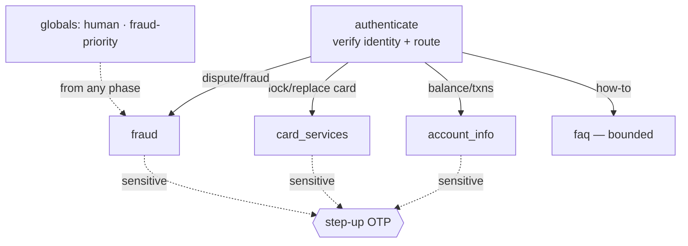

# Banking — Card, Fraud & Account Support (voice, inbound)

Inbound retail-bank / fintech support agent: balance & transaction info, card lock/replace, transaction
disputes, and fraud-alert response — with **step-up authentication** before any sensitive action. Modeled on
Fin (fintech pack), Decagon, Retell (Sunshine Loans), and Cognigy conversational-banking agents.

> Never gives financial or investment advice; never reads full card/account numbers (last 4 only); never
> moves money — funds transfers route to a secure channel or a human.

## Workflow



## Tools
`verify_identity` · `step_up_auth` + `verify_otp` · `get_balance` (baseline) · `get_transactions` (step-up) ·
`lock_card` / `order_replacement_card` (step-up) · `file_dispute` (step-up) · `report_fraud` (locks+escalates) ·
`search_kb` · `escalate_to_human`

## Guardrails (enforced in code, not by the model)
- No account interaction before `verify_identity`.
- Sensitive actions (`get_transactions`, `lock_card`, `order_replacement_card`, `file_dispute`) blocked until
  `step_up_verified` — enforced by `_require_step_up()` in each tool.
- Agent cannot move money; `report_fraud` always locks the card and escalates (cannot be downgraded).

## Run
```bash
pip install -r ../requirements.txt
python agent.py dev
```
`config.json` = declarative definition; `agent.py` = runnable LiveKit worker (tool backends mocked inline).
See [`../SCHEMA.md`](../SCHEMA.md).
