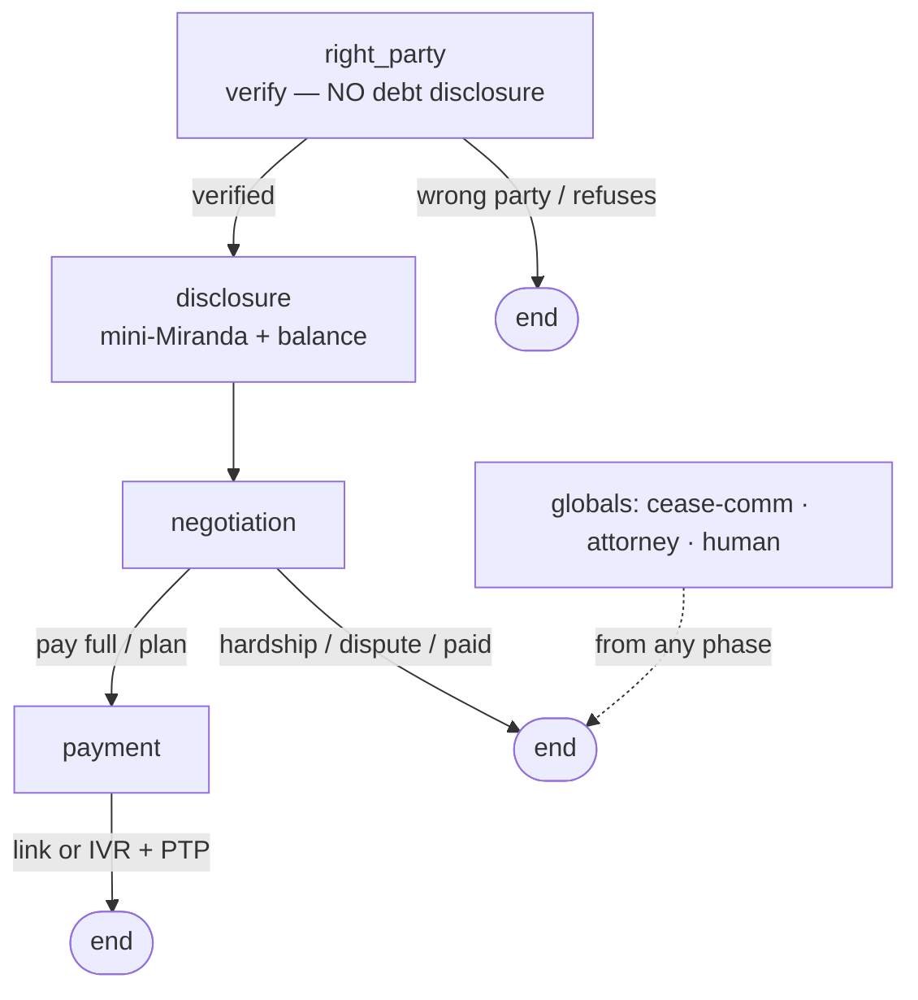

# Debt Collection / Payment Reminder (voice, outbound)

The **#1 identifiable prod vertical** and the reference implementation for the seed format. Verifies the
right party **before any debt disclosure**, delivers required disclosures, and secures a payment, plan, or a
compliant next step. Modeled on Retell (Medical Data Systems) and Bland collections pathways.

> ⚠️ FDCPA/TCPA logic here is an **engineering scaffold, not legal advice** — review with counsel and
> localize before any live use.

## Workflow



## Tools
`verify_identity` · `get_account_summary` (verified-only) · `get_plan_options` · `record_promise_to_pay` ·
`send_payment_link` · `transfer_to_payment_ivr` · `log_dispute` · `log_cease_communication` ·
`log_attorney_representation` · `schedule_callback` · `leave_compliant_message` · `escalate_to_human`

## Guardrails (enforced in code, not by the model)
- No debt/balance/creditor disclosed until `right_party_verified` (third-party disclosure = FDCPA §805).
- mini-Miranda spoken verbatim on entry to `disclosure` (a fixed string).
- cease-communication / dispute / attorney honored on the **first** request, from any phase.
- No card/bank/CVV captured by voice — payment via secure link or IVR only.

## Run
```bash
pip install -r ../requirements.txt
# env: LIVEKIT_URL, LIVEKIT_API_KEY, LIVEKIT_API_SECRET, OPENAI_API_KEY, DEEPGRAM_API_KEY, CARTESIA_API_KEY
python agent.py dev
```
Tool backends are **mocked inline** in `agent.py`; point them at real endpoints (`{{FAI_TOOL_BASE}}`, SIP
targets) for production. `config.json` is the declarative definition (prompt workflow + tools); `agent.py`
is the runnable LiveKit worker built from it. See [`../SCHEMA.md`](../SCHEMA.md).
