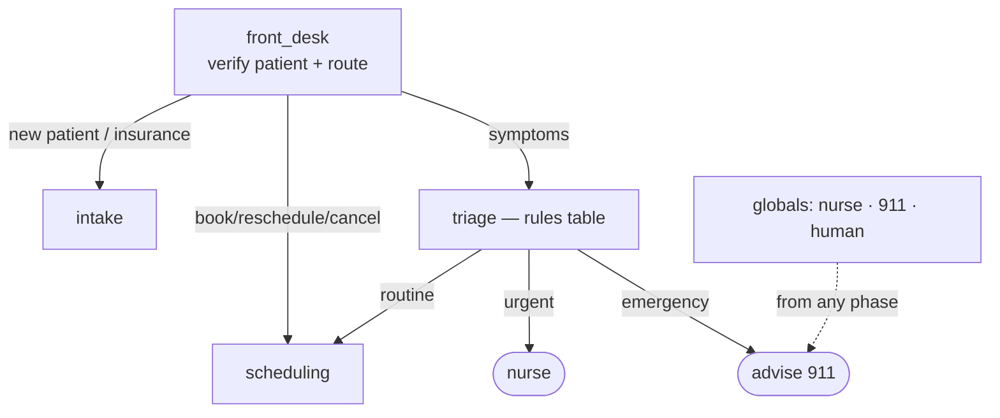

# Healthcare — Scheduling, Intake & Triage (voice, inbound)

Inbound clinic front-desk agent: books/reschedules/cancels appointments, captures patient intake +
insurance, and does **rules-based symptom triage** that routes red-flags to 911 / a nurse. Modeled on
LiveKit's `medical_office_triage` / `frontdesk` / `healthcare` examples and Vapi/Retell/Parloa healthcare
agents.

> Never diagnoses or gives medical advice; PHI disclosed only after identity verification. Operates under
> applicable health-privacy rules (e.g. HIPAA).

## Workflow



## Tools
`verify_patient` · `check_availability` · `book_appointment` (verified-only) · `reschedule_appointment` ·
`cancel_appointment` · `capture_insurance` · `send_intake_form_link` · `triage_check` (rules table) ·
`transfer_to_nurse` · `advise_emergency`

## Guardrails (enforced in code, not by the model)
- No patient record (PHI) read/changed until `verified`.
- Urgency is decided by the `triage_check` **rules table**, not the model; an `emergency` band forces
  `advise_emergency` and blocks scheduling (see `RED_FLAGS` in `agent.py`).
- Red-flag symptoms detected at any point route to 911 before any other action.

## Run
```bash
pip install -r ../requirements.txt
python agent.py dev
```
`config.json` = declarative definition; `agent.py` = runnable LiveKit worker (tool backends mocked inline).
See [`../SCHEMA.md`](../SCHEMA.md).
