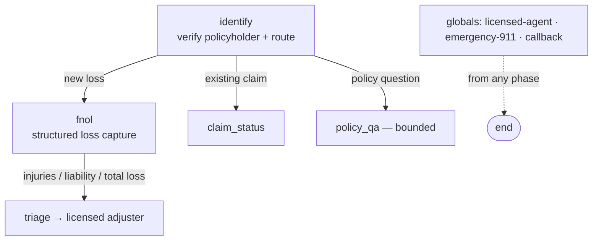

# Insurance — FNOL & Claims Intake (voice, inbound)

Inbound insurance intake agent: takes **First Notice of Loss**, answers claim-status and general policy
questions, and routes anything needing a coverage determination, quote, or advice to a **licensed human**.
Modeled on Retell (Matic), Bland, Fin, and Cognigy's pre-trained insurance agent.

> This is an **unlicensed-intake role** — it never quotes, binds, confirms coverage, or advises (role-boundary
> insight from the FutureAGI insurance eval pack). Compliance control, not legal advice.

## Workflow



## Tools
`verify_policyholder` · `create_fnol` · `get_claim_status` (verified-only) · `send_document_upload_link` ·
`send_claim_confirmation` · `search_policy_kb` (bounded) · `schedule_adjuster_callback` ·
`advise_emergency` · `escalate_to_licensed_agent`

## Guardrails (enforced in code, not by the model)
- No policy/claim details read until `verified`.
- Coverage determinations, premium quotes, and advice are never produced — those intents route to
  `escalate_to_licensed_agent`.
- Emergency indicators trigger `advise_emergency` before any other flow.

## Run
```bash
pip install -r ../requirements.txt
python agent.py dev
```
`config.json` = declarative definition; `agent.py` = runnable LiveKit worker (tool backends mocked inline).
See [`../SCHEMA.md`](../SCHEMA.md).
